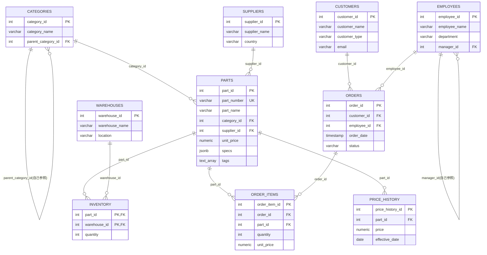
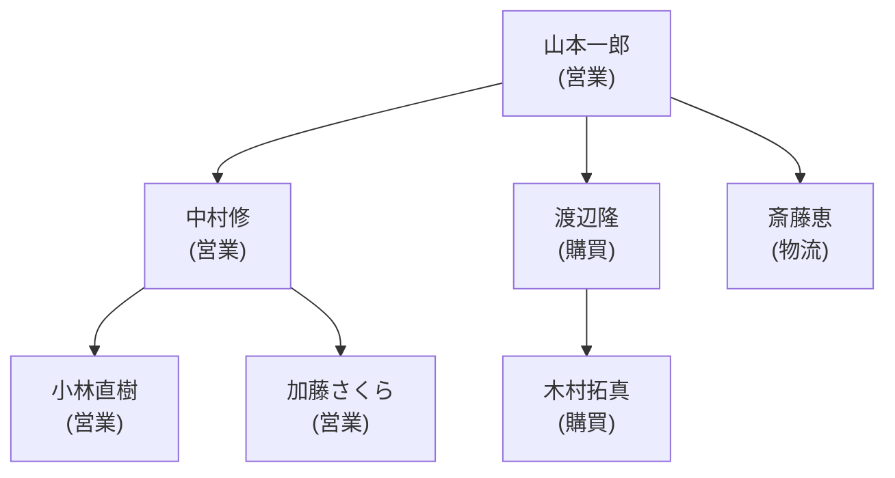
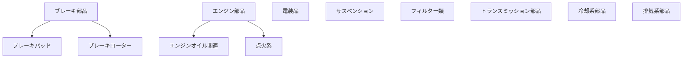

# PostgreSQL SQL構文チュートリアル(実践編)

このチュートリアルは、自動車部品商社「PartsDepot」を想定したサンプルデータベースを使って、PostgreSQLでよく使うSQL構文を一通り学べるように作成しました。掲載しているSQLはすべて実際にPostgreSQL 16上で実行し、結果を確認済みです。

後半の「データベース設計とSQLアンチパターン」編とセットで読むことを想定しています。

---

## 0. サンプルデータベースのセットアップ

同梱の `schema.sql`(テーブル定義)と `seed_data.sql`(投入データ)を使います。

```bash
createdb partsdepot
psql -d partsdepot -f schema.sql
psql -d partsdepot -f seed_data.sql
```

### テーブル構成(ER概要)

| テーブル | 内容 | 主な関連 |
|---|---|---|
| `categories` | 部品カテゴリ(自己参照で階層構造) | `parent_category_id` → 自テーブル |
| `suppliers` | 仕入先 | |
| `parts` | 部品マスタ(価格・重量・JSONB仕様・タグ配列) | `category_id`, `supplier_id` |
| `warehouses` | 倉庫 | |
| `inventory` | 倉庫別在庫(複合主キー) | `part_id`, `warehouse_id` |
| `customers` | 顧客(法人ディーラー/個人) | |
| `employees` | 従業員(自己参照で上司/部下) | `manager_id` → 自テーブル |
| `orders` | 受注ヘッダ | `customer_id`, `employee_id` |
| `order_items` | 受注明細 | `order_id`, `part_id` |
| `price_history` | 価格改定履歴 | `part_id` |

### ER図



`||--o{` は「1対多」を表す記法です(左側が1、右側が多)。`categories` と `employees` は自己参照(自分の主キーを自分の外部キーが指す)で階層構造を表現している点に注目してください。

以降のSQLは、断りがない限りすべて `partsdepot` データベースに対して実行します。

---

## 1. 基本のSELECT

```sql
-- 全カラム取得(実務では非推奨。理由は後半のアンチパターン編で解説)
SELECT * FROM parts;

-- 必要なカラムだけ
SELECT part_number, part_name, unit_price FROM parts;

-- 条件で絞り込み
SELECT part_name, unit_price FROM parts WHERE unit_price >= 10000;

-- 並び替え(ASC=昇順が既定、DESC=降順)
SELECT part_name, unit_price FROM parts ORDER BY unit_price DESC;

-- 件数制限・ページング
SELECT part_name, unit_price FROM parts ORDER BY unit_price DESC LIMIT 5 OFFSET 10;

-- 重複を除去
SELECT DISTINCT customer_type FROM customers;
```

---

## 2. 条件式

```sql
-- 比較演算子
SELECT part_name FROM parts WHERE weight_kg > 5;

-- 範囲指定(境界値を含む)
SELECT part_name, unit_price FROM parts WHERE unit_price BETWEEN 3000 AND 10000;

-- 複数値のいずれか
SELECT part_name FROM parts WHERE category_id IN (9, 10);

-- 部分一致(LIKEは大文字小文字を区別、ILIKEは区別しない)
SELECT part_name FROM parts WHERE part_name LIKE '%フィルター%';
SELECT supplier_name FROM suppliers WHERE supplier_name ILIKE '%motors%';

-- NULL判定(= NULL ではなく IS NULL / IS NOT NULL を使う)
SELECT employee_name FROM employees WHERE manager_id IS NULL;

-- 論理演算子
SELECT part_name FROM parts
WHERE category_id = 3 AND unit_price > 10000;

-- CASE式(条件分岐)
SELECT part_name, unit_price,
  CASE
    WHEN unit_price >= 20000 THEN '高額'
    WHEN unit_price >= 5000  THEN '中額'
    ELSE '低額'
  END AS price_band
FROM parts ORDER BY unit_price DESC LIMIT 5;
```

実行結果:
```
     part_name      | unit_price | price_band 
---------------------+------------+------------
 触媒コンバーター    |   34800.00 | 高額
 クラッチキット      |   28600.00 | 高額
 オルタネーター      |   24800.00 | 高額
 マフラー(純正相当)  |   22400.00 | 高額
 スターターモーター  |   19800.00 | 中額
```

---

## 3. 集計とGROUP BY / HAVING

```sql
-- 単純な集計
SELECT count(*), avg(unit_price), max(unit_price), min(unit_price)
FROM parts;

-- グループごとの集計
SELECT category_id, count(*) AS part_count, avg(unit_price)::numeric(10,0) AS avg_price
FROM parts
GROUP BY category_id
ORDER BY avg_price DESC;

-- 集計結果をさらに絞り込む(WHEREではなくHAVINGを使う)
SELECT category_id, count(*), avg(unit_price)::numeric(10,0) AS avg_price
FROM parts
GROUP BY category_id
HAVING avg(unit_price) > 10000
ORDER BY avg_price DESC;
```

実行結果:
```
 category_id | count | avg_price 
-------------+-------+-----------
           8 |     3 |     19467
           1 |     1 |     15800
           3 |     4 |     15450
           6 |     3 |     11467
           2 |     2 |     11100
```

**WHEREとHAVINGの違い**: `WHERE` は集計前の行を絞り込み、`HAVING` は集計後のグループを絞り込みます。「平均単価が1万円を超えるカテゴリ」のような条件はHAVINGでしか書けません。

---

## 4. JOIN

サンプルDBには `parts → categories/suppliers`、`orders → customers/employees`、`order_items → orders/parts` のように複数の外部キー関係があります。

```sql
-- INNER JOIN: 両方に一致する行だけ
SELECT p.part_name, c.category_name, s.supplier_name
FROM parts p
JOIN categories c ON c.category_id = p.category_id
JOIN suppliers  s ON s.supplier_id = p.supplier_id
LIMIT 5;

-- LEFT JOIN: 左側は全件、右側は一致しなければNULL
-- (在庫データが存在しない部品×倉庫の組み合わせを検出)
SELECT p.part_name, w.warehouse_name
FROM parts p
CROSS JOIN warehouses w
LEFT JOIN inventory i ON i.part_id = p.part_id AND i.warehouse_id = w.warehouse_id
WHERE i.part_id IS NULL
LIMIT 5;

-- CROSS JOIN: 全組み合わせ(直積)。上の例でも使っている
SELECT p.part_name, w.warehouse_name FROM parts p CROSS JOIN warehouses w;

-- SELF JOIN: 従業員テーブルを自分自身と結合して上司名を引く
SELECT e.employee_name AS employee, m.employee_name AS manager
FROM employees e
LEFT JOIN employees m ON e.manager_id = m.employee_id
ORDER BY e.employee_id;

-- USING句: 結合キーのカラム名が同じ場合の省略記法(ON句と等価)
SELECT order_id, part_name FROM order_items JOIN parts USING (part_id) LIMIT 3;
```

SELF JOINの実行結果:
```
  employee  | manager  
------------+----------
 山本一郎   | 
 中村修     | 山本一郎
 小林直樹   | 中村修
 加藤さくら | 中村修
 渡辺隆     | 山本一郎
 木村拓真   | 渡辺隆
 斎藤恵     | 山本一郎
```

この上司-部下関係を図にすると、以下のような組織図になります(`employees.manager_id` の自己参照そのものです)。



> PostgreSQLは `RIGHT JOIN` と `FULL [OUTER] JOIN` もサポートしています。`RIGHT JOIN A ON ...` は `LEFT JOIN` の左右を入れ替えただけなので、実務ではLEFT JOINに統一して書くと読みやすくなります。

---

## 5. サブクエリ

```sql
-- スカラサブクエリ(1行1列を返す)
SELECT part_name, unit_price,
       unit_price - (SELECT avg(unit_price) FROM parts) AS diff_from_avg
FROM parts
ORDER BY diff_from_avg DESC LIMIT 5;

-- IN サブクエリ: ブレーキ関連カテゴリの部品を発注したことのある顧客
SELECT DISTINCT c.customer_name
FROM customers c
WHERE c.customer_id IN (
    SELECT o.customer_id
    FROM orders o
    JOIN order_items oi ON oi.order_id = o.order_id
    JOIN parts p ON p.part_id = oi.part_id
    WHERE p.category_id IN (9, 10)
);

-- EXISTS: 1件でも受注実績のある部品(存在チェックのみなので効率的)
SELECT p.part_name
FROM parts p
WHERE EXISTS (
    SELECT 1 FROM order_items oi WHERE oi.part_id = p.part_id
)
LIMIT 5;

-- 相関サブクエリ: 各カテゴリの中で最も高い部品
SELECT p.part_name, p.category_id, p.unit_price
FROM parts p
WHERE p.unit_price = (
    SELECT max(p2.unit_price) FROM parts p2 WHERE p2.category_id = p.category_id
);
```

### NOT IN の落とし穴

`NOT IN` のサブクエリ結果に `NULL` が1件でも含まれると、想定外の結果(0件)になります。サンプルDBで実際に再現できます。

```sql
SELECT count(*) FROM parts WHERE part_id NOT IN (1, 2, NULL);
```
```
 count 
-------
     0
```

本来は「id=1,2以外」で30件ヒットするはずですが、リストにNULLが混ざるだけで全体が0件になります。これは `part_id <> NULL` が常に `UNKNOWN`(真でも偽でもない)と評価されるためです。同じ条件を `NOT EXISTS` で書けば正しく動きます。

```sql
SELECT count(*) FROM parts p
WHERE NOT EXISTS (
    SELECT 1 FROM (VALUES (1),(2),(NULL::int)) x(part_id) WHERE x.part_id = p.part_id
);
```
```
 count 
-------
    30
```

**実務での指針**: サブクエリの対象カラムがNULL許容なら `NOT IN` は避け、`NOT EXISTS` を使う。

---

## 6. CTE(WITH句)

```sql
-- 通常のCTE: 複雑なクエリを名前付きの中間結果に分割できる
WITH category_avg AS (
    SELECT category_id, avg(unit_price) AS avg_price
    FROM parts GROUP BY category_id
)
SELECT p.part_name, p.unit_price, ca.avg_price
FROM parts p
JOIN category_avg ca ON ca.category_id = p.category_id
WHERE p.unit_price > ca.avg_price;

-- 再帰CTE: カテゴリの階層(親子関係)をたどる
WITH RECURSIVE cat_tree AS (
    SELECT category_id, category_name, category_id AS root_id
    FROM categories WHERE parent_category_id IS NULL
    UNION ALL
    SELECT c.category_id, c.category_name, ct.root_id
    FROM categories c
    JOIN cat_tree ct ON c.parent_category_id = ct.category_id
)
SELECT r.category_name AS root_category, count(p.part_id) AS part_count
FROM cat_tree ct
JOIN categories r ON r.category_id = ct.root_id
LEFT JOIN parts p ON p.category_id = ct.category_id
GROUP BY r.category_name
ORDER BY part_count DESC;
```

実行結果:
```
     root_category      | part_count 
-------------------------+------------
 エンジン部品            |          6
 ブレーキ部品            |          6
 サスペンション          |          4
 電装品                  |          4
 フィルター類            |          3
 トランスミッション部品  |          3
 冷却系部品              |          3
 排気系部品              |          3
```

`categories` テーブルの親子関係(`ブレーキ部品` の下に `ブレーキパッド` `ブレーキローター` がぶら下がる、`エンジン部品` の下に `エンジンオイル関連` `点火系` がぶら下がる)を図にすると次のようになります。



上の再帰CTEは、`categories` のどんな深さの木構造でも(3階層でも5階層でも)同じSQLでたどれます。JOINを手動で連結する方式との違いは後半の「データベース設計とSQLアンチパターン」編の *Naive Trees* で解説します。

```sql
-- 再帰CTEで組織図をインデント表示
WITH RECURSIVE org AS (
    SELECT employee_id, employee_name, manager_id, 1 AS depth,
           employee_name::text AS path
    FROM employees WHERE manager_id IS NULL
    UNION ALL
    SELECT e.employee_id, e.employee_name, e.manager_id, o.depth + 1,
           o.path || ' > ' || e.employee_name
    FROM employees e JOIN org o ON e.manager_id = o.employee_id
)
SELECT repeat('　', depth - 1) || employee_name AS org_chart, depth
FROM org ORDER BY path;
```

組織図の実行結果:
```
   org_chart    | depth 
----------------+-------
 山本一郎       |     1
 　中村修       |     2
 　　加藤さくら |     3
 　　小林直樹   |     3
 　斎藤恵       |     2
 　渡辺隆       |     2
 　　木村拓真   |     3
```

再帰CTEは `UNION ALL` の前(アンカー)で起点行を、後(再帰項)で「1階層先」を取得する処理を書き、結果が空になるまで繰り返します。組織図・部品の親子構成・カテゴリツリーなど「木構造」を扱うときの定番パターンです。

---

## 7. ウィンドウ関数

集計しても行を潰さずに「他の行との関係」を各行に付与できるのがウィンドウ関数です。`GROUP BY` と違い、明細行を保持したまま順位や累計を計算できます。

```sql
-- ROW_NUMBER / RANK: カテゴリごとの価格順位
SELECT part_name, category_id, unit_price,
  ROW_NUMBER() OVER (PARTITION BY category_id ORDER BY unit_price DESC) AS rn,
  RANK()       OVER (PARTITION BY category_id ORDER BY unit_price DESC) AS rk
FROM parts
WHERE category_id IN (9, 10);

-- LAG: 価格改定履歴から前回価格・変化率を計算
SELECT part_id, effective_date, price,
  LAG(price) OVER (PARTITION BY part_id ORDER BY effective_date) AS prev_price,
  ROUND(
    100.0 * (price - LAG(price) OVER (PARTITION BY part_id ORDER BY effective_date))
    / LAG(price) OVER (PARTITION BY part_id ORDER BY effective_date), 1
  ) AS pct_change
FROM price_history
WHERE part_id = 1
ORDER BY effective_date;

-- 累計(running total): 特定顧客の注文を時系列に積み上げ
SELECT order_id, order_date::date,
  SUM(quantity * unit_price) AS order_total,
  SUM(SUM(quantity * unit_price)) OVER (ORDER BY order_date) AS running_total
FROM order_items JOIN orders USING (order_id)
WHERE customer_id = 1
GROUP BY order_id, order_date
ORDER BY order_date;
```

LAGの実行結果(BRK-1001の値上がり推移):
```
 part_id | effective_date |  price  | prev_price | pct_change 
---------+----------------+---------+------------+------------
       1 | 2025-01-15     | 4100.00 |            |            
       1 | 2025-07-15     | 4500.00 |    4100.00 |        9.8
       1 | 2026-01-15     | 4800.00 |    4500.00 |        6.7
```

累計の実行結果:
```
 order_id | order_date | order_total | running_total 
----------+------------+-------------+---------------
        1 | 2026-01-08 |   118400.00 |     118400.00
        6 | 2026-02-03 |   114400.00 |     232800.00
       11 | 2026-03-02 |    99000.00 |     331800.00
       17 | 2026-04-09 |   128000.00 |     459800.00
       21 | 2026-05-10 |    78300.00 |     538100.00
       24 | 2026-06-15 |   189000.00 |     727100.00
```

`ROW_NUMBER` は同順位でも必ず連番、`RANK` は同順位なら同じ順位で次の順位が飛ぶ、`DENSE_RANK` は同順位でも次の順位が飛びません。用途に応じて使い分けます。

---

## 8. データ変更(DML)

```sql
-- INSERT + RETURNING(挿入した行をそのまま受け取れる)
INSERT INTO customers (customer_name, customer_type, email)
VALUES ('サンプル商会', 'dealer', 'sample@example.com')
RETURNING customer_id, customer_name;

-- UPDATE + RETURNING
UPDATE parts SET unit_price = unit_price * 1.05
WHERE part_id = 7
RETURNING part_name, unit_price;

-- DELETE(対象を絞らないと全件消えるので要注意)
DELETE FROM order_items WHERE order_id = 8;

-- UPSERT: あれば更新、なければ挿入(ON CONFLICT)
INSERT INTO inventory (part_id, warehouse_id, quantity, updated_at)
VALUES (1, 1, 50, now())
ON CONFLICT (part_id, warehouse_id)
DO UPDATE SET quantity = inventory.quantity + EXCLUDED.quantity,
              updated_at = now()
RETURNING *;
```

`ON CONFLICT` の対象には、複合主キーやUNIQUE制約が張られた列の組を指定します。`EXCLUDED` は「挿入しようとした新しい値」を参照するための特別なエイリアスです。

---

## 9. トランザクション

```sql
BEGIN;

UPDATE inventory SET quantity = quantity - 5
WHERE part_id = 1 AND warehouse_id = 1;

INSERT INTO orders (customer_id, employee_id, order_date, status)
VALUES (1, 3, now(), 'pending');

-- 問題なければ確定、まずければ取り消す
COMMIT;   -- または ROLLBACK;
```

複数テーブルにまたがる更新(在庫を減らして受注を作る、など)は必ずトランザクションでまとめます。途中で `SAVEPOINT` を打てば、トランザクション全体を破棄せず一部だけロールバックできます。

```sql
BEGIN;
UPDATE inventory SET quantity = quantity - 5 WHERE part_id = 1 AND warehouse_id = 1;
SAVEPOINT before_order;
INSERT INTO orders (customer_id, employee_id, order_date) VALUES (1, 3, now());
ROLLBACK TO SAVEPOINT before_order; -- 受注INSERTだけ取り消す
COMMIT;
```

---

## 10. PostgreSQL独自機能

### JSONB(半構造データ)

`parts.specs` は材質やサイズなど、部品によって項目が違う属性をJSONBで保持しています。

```sql
-- キーを指定して値を取得(->> はテキストとして取得)
SELECT part_name, specs->>'material' AS material FROM parts WHERE specs ? 'material';

-- 特定のキー・値を含む行を検索(@> は包含演算子)
SELECT part_name FROM parts WHERE specs @> '{"material": "ceramic"}';
```

実行結果:
```
             part_name              | material 
-------------------------------------+----------
 フロントブレーキパッド(セラミック) | ceramic
 リアブレーキパッド(セラミック)     | ceramic
```

`specs` 列には `USING GIN` のインデックスを張っているので、この手のJSONB検索でもインデックスが効きます(後述のEXPLAINで確認できます)。

### 配列型

`parts.tags` はテキスト配列です。

```sql
-- 配列に特定の要素が含まれるか
SELECT part_name, tags FROM parts WHERE 'led' = ANY(tags);

-- 配列を展開して1行1要素に(集計に便利)
SELECT unnest(tags) AS tag, count(*) FROM parts GROUP BY tag ORDER BY count(*) DESC;
```

### LATERAL JOIN

サブクエリの中で外側のテーブルの列を参照できます。「各顧客の直近N件」のような相関クエリを効率よく書けます。

```sql
SELECT c.customer_name, o2.order_id, o2.order_date
FROM customers c
CROSS JOIN LATERAL (
    SELECT order_id, order_date FROM orders o
    WHERE o.customer_id = c.customer_id
    ORDER BY order_date DESC LIMIT 2
) o2
ORDER BY c.customer_name, o2.order_date DESC;
```

### DISTINCT ON

「グループごとの最新1件」を1回のクエリで取れるPostgreSQL独自の構文です(`ORDER BY` の並び順が結果を決めるので、対象キー→並び替えたい列の順で必ず指定します)。

```sql
SELECT DISTINCT ON (part_id) part_id, effective_date, price
FROM price_history
ORDER BY part_id, effective_date DESC;
```

### generate_series で日付の穴を埋める

売上ゼロの日も含めた日次レポートを作るときの定番です。

```sql
SELECT d::date AS day, COALESCE(SUM(oi.quantity * oi.unit_price), 0) AS sales
FROM generate_series('2026-01-08'::date, '2026-01-12'::date, '1 day') d
LEFT JOIN orders o ON o.order_date::date = d
LEFT JOIN order_items oi ON oi.order_id = o.order_id
GROUP BY d ORDER BY d;
```

実行結果:
```
    day     |   sales   
------------+-----------
 2026-01-08 | 118400.00
 2026-01-09 |         0
 2026-01-10 |   5560.00
 2026-01-11 |         0
 2026-01-12 |         0
```

### よく使う文字列・日付関数

```sql
SELECT string_agg(part_name, ', ' ORDER BY part_name) AS items
FROM order_items JOIN parts USING (part_id)
WHERE order_id = 1;

SELECT date_trunc('month', order_date) AS month, count(*) FROM orders GROUP BY 1 ORDER BY 1;

SELECT order_date, order_date + interval '30 days' AS due_date FROM orders LIMIT 3;

SELECT extract(dow FROM order_date) AS day_of_week FROM orders LIMIT 3;
```

---

## 11. インデックスとEXPLAINの基礎

```sql
EXPLAIN SELECT * FROM parts WHERE category_id = 9;
```
```
QUERY PLAN
----------------------------------------------------------------------------------
Index Scan using idx_parts_category on parts  (cost=0.14..8.16 rows=1 width=390)
  Index Cond: (category_id = 9)
```

`Index Scan` になっていれば `idx_parts_category` インデックスが使われています。`Seq Table Scan`(全件走査)になっている場合は、条件に使っている列にインデックスがないか、テーブルが小さすぎてオプティマイザが「全件読んだ方が速い」と判断したかのどちらかです。`EXPLAIN ANALYZE` を使うと実際の実行時間も確認できます。

インデックス設計の考え方は後半の「データベース設計とSQLアンチパターン」編で扱います。

---

これで基本的な構文は一通りカバーしました。次は `02_database_design_and_antipatterns.md` で、テーブル設計の基礎とよくある失敗パターンを見ていきます。
