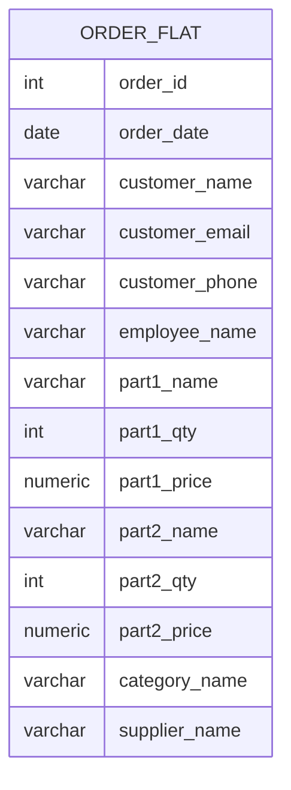
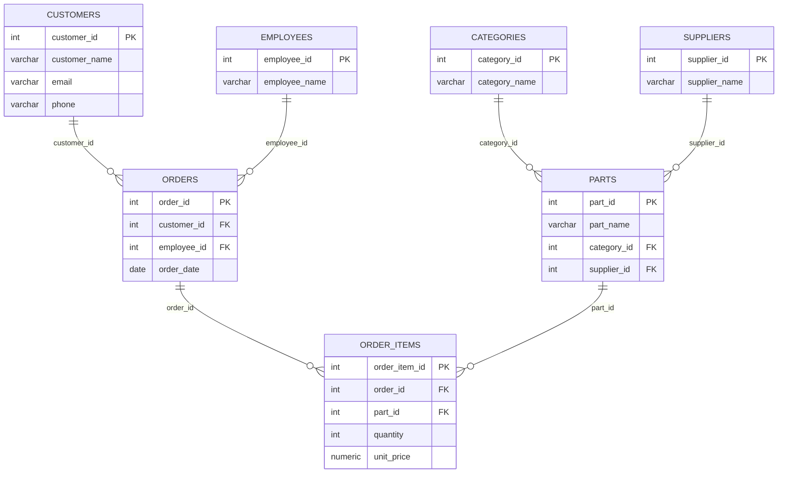
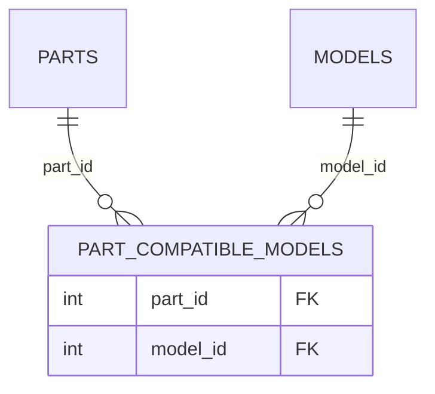
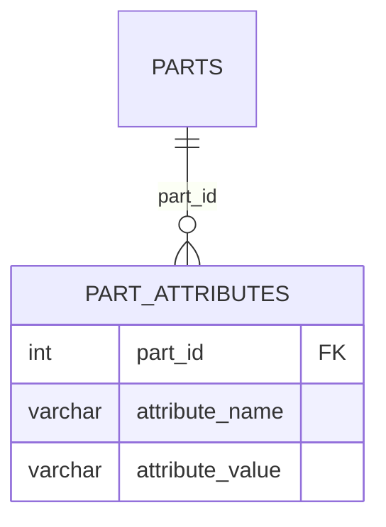
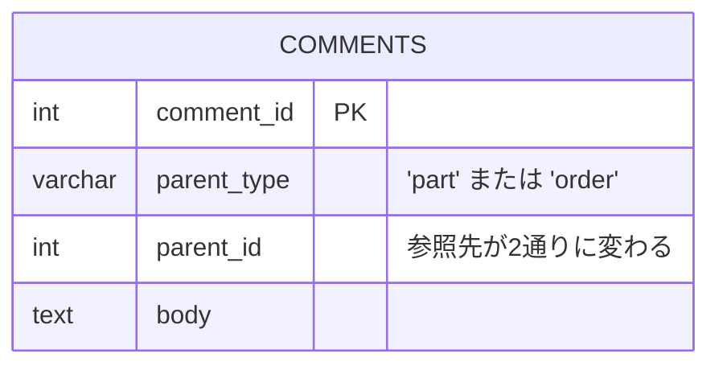
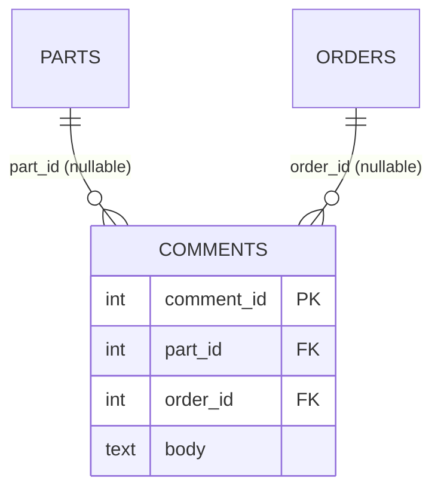
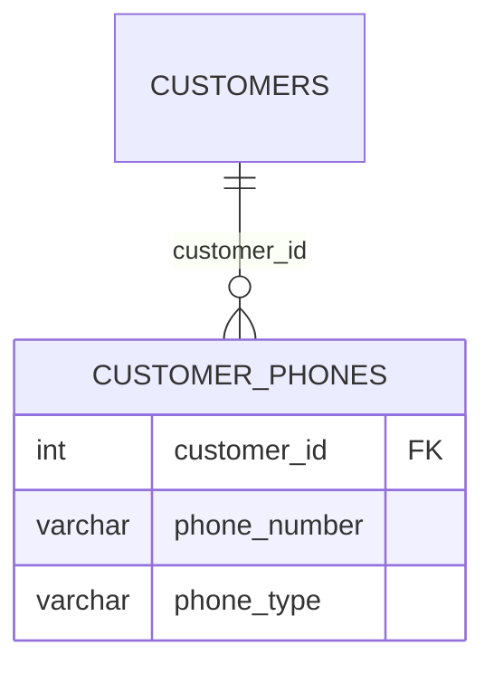
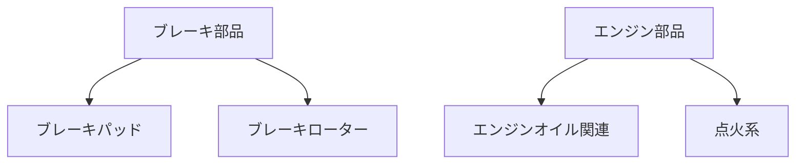

# データベース設計の基礎とSQLアンチパターン

`01_postgres_sql_tutorial.md` で使った「PartsDepot」サンプルDBを題材に、テーブル設計の基本と、Bill Karwinの著書『SQL Antipatterns』で整理されているような典型的な失敗パターンを見ていきます。悪い例は原則として実行していない疑似DDLですが、制約違反やGROUP BYのエラーなど実際にPostgreSQLで再現できるものは実行結果も載せています。

---

# Part 1. データベース設計の基礎

## 1.1 正規化(正規形)

正規化とは、「1つの事実は1箇所にだけ保存する」ことでデータの矛盾や更新漏れを防ぐ設計手法です。よく使うのは第1〜第3正規形(1NF/2NF/3NF)です。

### 悪い例: 何もかも1枚に詰め込んだ「フラットテーブル」



テーブルが1つだけで、関連を示す線が1本も引けない(=独立した実体を区別できていない)こと自体がすでに設計上の危険信号です。このテーブルには3段階の問題があります。

**第1正規形(1NF)違反**: `part1_*` `part2_*` のような繰り返し項目がある。3点以上注文したら `part3_*` を増やす羽目になり、1件のセルに複数の意味を持たせている。
→ 対策: 明細を別テーブル(`order_items`)に分離し、行として持つ。

**第2正規形(2NF)違反**: 仮に主キーを `(order_id, part_id)` の複合キーにしたとして、`customer_name` は `order_id` だけで決まり、`part_id` には依存しない(複合主キーの一部だけに従属する「部分関数従属」)。
→ 対策: `customer_name` を `order_items` から追い出し、`orders` テーブル側に持たせる。

**第3正規形(3NF)違反**: `orders` テーブルに `customer_name` や `customer_email` を置いたとしても、これらは本来 `customer_id` に従属する情報であり、`order_id` に直接従属してはいない(`order_id → customer_id → customer_name` という推移的関数従属)。
→ 対策: 顧客情報を `customers` テーブルに分離し、`orders` は `customer_id` を外部キーとして持つだけにする。

この3段階を経ると、`ORDER_FLAT` は最終的に以下のように分解され、今回のサンプルDBの `customers` / `orders` / `order_items` / `parts` という構成にたどり着きます。



1枚のフラットテーブルだった `ORDER_FLAT` が、それぞれ独立した実体(顧客・従業員・受注・明細・部品・カテゴリ・仕入先)とその関連に分解されているのがわかります。正規化は「テーブル数を無限に増やす作業」ではなく、「1つの事実の置き場所を1つに決める作業」だと捉えると迷いにくくなります。

> 実務では、集計処理の高速化のためにあえて非正規化(冗長にデータを持つ)する判断もあります。ただしそれは正規化された設計を理解した上での意図的なトレードオフであるべきで、最初から正規化をサボることとは違います。

## 1.2 主キー(PRIMARY KEY)と外部キー(FOREIGN KEY)

### 主キーの機能と必要性

主キーは「テーブルの中で、この行はこれだ」と一意に指し示すための列(または列の組み合わせ)です。PostgreSQLで `PRIMARY KEY` を指定すると、自動的に2つの性質がセットで付きます。

- **一意性(UNIQUE)**: 同じ値を持つ行が2つ存在できない
- **必須(NOT NULL)**: 値が必ず入っていなければならない

サンプルDBの `parts.part_id` で実際に確認できます。

```sql
-- 重複するpart_idは拒否される
INSERT INTO parts (part_id, part_number, part_name, category_id, supplier_id, unit_price)
VALUES (1, 'DUP-001', '重複テスト', 1, 1, 100);
```
```
ERROR:  duplicate key value violates unique constraint "parts_pkey"
DETAIL:  Key (part_id)=(1) already exists.
```

```sql
-- NULLも拒否される(PRIMARY KEY = UNIQUE + NOT NULL)
INSERT INTO parts (part_id, part_number, part_name, category_id, supplier_id, unit_price)
VALUES (NULL, 'NULL-001', 'NULLテスト', 1, 1, 100);
```
```
ERROR:  null value in column "part_id" of relation "parts" violates not-null constraint
```

主キーがなぜ必要かというと、次の3点に集約されます。

1. **行を一意に特定する手段がなくなる**: 主キーがないと、「この1行だけを更新/削除して」と確実に指示する方法がありません。`part_name` で絞り込んでも、同名の部品が複数あれば意図しない行まで巻き込みます。
2. **他のテーブルから参照できない**: 後述の外部キーは「どこかのテーブルの主キーを指す」ことでテーブル間の関連を表現します。指す先(主キー)がなければ関連づけようがありません。
3. **検索が自動的に速くなる**: `PRIMARY KEY` を指定すると、PostgreSQLは自動的にその列にユニークインデックス(Bツリー)を作成します。`\d parts` で確認すると:

```
Indexes:
    "parts_pkey" PRIMARY KEY, btree (part_id)
    ...
Referenced by:
    TABLE "inventory" CONSTRAINT "inventory_part_id_fkey" FOREIGN KEY (part_id) REFERENCES parts(part_id)
    TABLE "order_items" CONSTRAINT "order_items_part_id_fkey" FOREIGN KEY (part_id) REFERENCES parts(part_id)
    TABLE "price_history" CONSTRAINT "price_history_part_id_fkey" FOREIGN KEY (part_id) REFERENCES parts(part_id)
```

この `Referenced by:` の一覧が、まさに「他のテーブルがこの主キーを頼りにしている」ことの証拠です。`inventory` も `order_items` も `price_history` も、「どの部品の話か」を `part_id` という1つの値だけで正確に指し示せています。

### 外部キーの機能と必要性

外部キーは、あるテーブルの列が「別テーブルの主キー(またはUNIQUE制約列)を指している」ことをDBに宣言する制約です(`order_items.part_id INTEGER REFERENCES parts(part_id)` のように書きます)。役割は大きく3つあります。

1. **参照整合性(referential integrity)の保証**: 「存在しない親を指す子」や「親を消したのに残る子」を防ぐ
2. **JOINの結合条件そのものになる**: `01` 資料のJOIN例は、すべてこの外部キー関係をそのまま `ON` 句に使っている
3. **スキーマ自体がドキュメントになる**: `REFERENCES` を見れば、そのテーブルが何と関連しているかがコード上で読み取れる

外部キーが「存在しない親を参照させない」場面と「参照されている親を消させない」場面を、それぞれ実際に確認できます。

```sql
-- 存在しない親(category_id=999)は挿入時点で拒否される
INSERT INTO parts (part_number, part_name, category_id, supplier_id, unit_price)
VALUES ('TEST-002', 'テスト部品', 999, 1, 100);
```
```
ERROR:  insert or update on table "parts" violates foreign key constraint "parts_category_id_fkey"
DETAIL:  Key (category_id)=(999) is not present in table "categories".
```

```sql
-- 子(parts)から参照されている親(categories)は勝手に削除できない
DELETE FROM categories WHERE category_id = 9;
```
```
ERROR:  update or delete on table "categories" violates foreign key constraint "parts_category_id_fkey" on table "parts"
DETAIL:  Key (category_id)=(9) is still referenced from table "parts".
```

もし外部キーがなかったら、このどちらのエラーも発生せず、代わりに「存在しないカテゴリを持つ部品」や「カテゴリが消えて宙に浮いた部品」がサイレントに生まれます。アプリ側のバリデーションだけに頼ると、コードのバグ・手動でのデータ修正・移行ツールの不具合など、あらゆる経路の不整合を防ぎきれません。DBそのものが最後の防波堤として整合性をチェックしてくれるのが外部キーの最大の価値です(この重要性は後述の *Keyless Entry* アンチパターンでも扱います)。

**削除時の挙動も決めておく**: 親行を消そうとしたときの動作は `ON DELETE` で指定します。

- `RESTRICT`(既定): 参照されている限り削除を拒否する。上の `categories` の例がこれです。
- `CASCADE`: 親を消したら子も一緒に消す。サンプルDBでは `order_items.order_id` に指定しており、受注ヘッダを消すと明細も連動して消えます。
- `SET NULL`: 親を消したら子の外部キー列をNULLにする。「関連が切れても子自体は残したい」ときに使います。

`order_items.part_id` に `ON DELETE` を明示的に指定していないのは意図的です。過去に売った部品を安易に削除できてしまうと、受注履歴という重要な事実が失われるため、既定の `RESTRICT` のままにしています。

### CHECK制約・UNIQUE制約

主キー・外部キー以外にも、値の妥当性を保証する制約があります。サンプルDBの `parts` テーブルではこう定義しています。

```sql
CREATE TABLE parts (
    part_id     SERIAL PRIMARY KEY,
    part_number VARCHAR(20) NOT NULL UNIQUE,
    category_id INTEGER NOT NULL REFERENCES categories(category_id),
    unit_price  NUMERIC(10,2) NOT NULL CHECK (unit_price >= 0),
    ...
);
```

```sql
-- CHECK制約違反(単価がマイナス)
INSERT INTO parts (part_number, part_name, category_id, supplier_id, unit_price)
VALUES ('TEST-001', 'テスト部品', 1, 1, -100);
```
```
ERROR:  new row for relation "parts" violates check constraint "parts_unit_price_check"
```

```sql
-- UNIQUE制約違反(主キーではなく、部品番号という業務上のコードの一意性を守る)
INSERT INTO parts (part_number, part_name, category_id, supplier_id, unit_price)
VALUES ('BRK-1001', '重複', 1, 1, 100);
```
```
ERROR:  duplicate key value violates unique constraint "parts_part_number_key"
DETAIL:  Key (part_number)=(BRK-1001) already exists.
```

制約は「アプリ側のバグでも壊れないデータの最後の砦」です。アプリ側でバリデーションしていても、DB側の制約は外さないのが基本方針です。

## 1.3 サロゲートキー vs 自然キー

- **サロゲートキー**: `SERIAL` や `UUID` など、業務的な意味を持たない人工的なID。`part_id`, `customer_id` など。
- **自然キー**: `part_number`(部品番号)のように、業務的に一意な値。

サンプルDBの `parts` は両方持っています。`part_id` を内部の結合キーとして使い、`part_number` は業務側が参照する一意なコードとして `UNIQUE` 制約だけ張っています。自然キーだけを主キーにすると、後で「部品番号の採番ルールを変えたい」となったときに全テーブルの外部キーを巻き込んで変更することになるため、サロゲートキーを内部結合用に用意しておくと変更に強くなります。

## 1.4 命名規則

厳密な正解はありませんが、チーム内で一貫させることが重要です。サンプルDBで採用している方針:

- テーブル名は複数形(`parts`, `customers`)、列名は `snake_case`
- 主キーは `<単数形テーブル名>_id`(例: `part_id`)
- 外部キーは参照先の主キー名をそのまま使う(例: `orders.customer_id` は `customers.customer_id` を参照)
- 中間テーブル・履歴テーブルは用途がわかる名前にする(`order_items`, `price_history`)
- 予約語(`order`, `user`, `group` など)は単独でテーブル名・列名にしない(`orders`, `users` のように複数形にすれば大抵回避できる)

## 1.5 インデックス設計の基本方針

- `WHERE` / `JOIN` / `ORDER BY` で頻繁に使う列にインデックスを張る(サンプルDBでは `idx_parts_category`, `idx_orders_customer` など)
- 複合インデックスは「先頭列から連続して使う条件」にしか効かない(左端一致の原則)。`(category_id, unit_price)` の複合インデックスは `WHERE category_id = 9` には効くが、`WHERE unit_price > 10000` 単体には効かない
- インデックスは検索を速くする代わりに書き込み(INSERT/UPDATE/DELETE)を遅くする。何でもかんでも張るのではなく、実際に使われるクエリを見て決める(後述の「Index Shotgun」も参照)
- 効いているかどうかは `EXPLAIN` / `EXPLAIN ANALYZE` で確認する(`01` 資料の末尾を参照)

---

# Part 2. SQLアンチパターン

ここからは、実務でよく踏みがちな失敗パターンを4つのカテゴリに分けて紹介します。それぞれ「悪い例」→「良い例」の順で、可能なものは実データでの検証結果も添えます。

## A. 論理設計のアンチパターン

### 1. Jaywalking(信号無視) ― カンマ区切りリストを1列に詰め込む

```sql
-- ❌ 悪い例: タグをカンマ区切り文字列で保存
-- parts.tags_text = 'brake,pad,ceramic'
SELECT * FROM parts WHERE tags_text LIKE '%ceramic%'; -- インデックスが効かない、誤検知もある
```

```sql
-- ✅ 良い例1: PostgreSQLならネイティブの配列型を使う(実際の設計)
SELECT part_name FROM parts WHERE 'led' = ANY(tags);

-- ✅ 良い例2: 多対多の実体同士の関係なら中間テーブルで正規化する
-- 例: 1つの部品が複数の互換車種を持つ場合
-- part_compatible_models(part_id, model_id) のような中間テーブル
```



カンマ区切り文字列は「検索できない・集計できない・重複チェックできない」の三重苦です。PostgreSQLの配列型やJSONB型はインデックスも効くため妥協案として使えますが、相手が「部品↔車種」のような独立した実体同士の関連なら、素直に中間テーブルで正規化するのが基本です。

### 2. EAV(Entity-Attribute-Value) ― 何でも入る汎用テーブル

```sql
-- ❌ 悪い例: 属性を行持ちにして「何でも入る」テーブルにする
-- part_attributes(part_id, attribute_name, attribute_value)
-- ('material','ceramic'), ('diameter_mm','296'), ...
SELECT part_id FROM part_attributes
WHERE attribute_name = 'material' AND attribute_value = 'ceramic';
-- 型がすべて文字列になる、1つの部品の属性を見るのに複数行JOINが要る、INSERT時に列名バリデーションが効かない
```



1つの部品の「材質」「直径」「重量」を見るだけなのに、この構造だと `PART_ATTRIBUTES` 側で該当部品の行を何行もJOIN/集約する必要があります。

```sql
-- ✅ 良い例: よく使う属性は普通の列に、可変・部品固有の属性はJSONBに(実際の設計)
SELECT part_name FROM parts WHERE specs @> '{"material": "ceramic"}';
```

EAVは「将来どんな属性が増えるかわからない」という不安から生まれがちですが、代償として型安全性・JOINの単純さ・パフォーマンスをすべて失います。サンプルDBでは、価格や重量のように全部品共通で必ずある属性は通常の列にし、材質やサイズのように部品カテゴリによってまちまちな属性だけを `specs JSONB` に逃がしています。

### 3. Polymorphic Associations(多態的関連) ― 1つの外部キーが状況で別テーブルを指す

```sql
-- ❌ 悪い例: comments.parent_type で参照先テーブルを切り替える
-- comments(comment_id, parent_type, parent_id, body)
-- parent_type='part' なら parts.part_id、parent_type='order' なら orders.order_id を指す
-- → 外部キー制約を張れない(参照先が固定できないため)
```



```sql
-- ✅ 良い例: 対象ごとに個別の外部キー列を用意し、片方は必ずNULLにする
-- comments(comment_id, part_id REFERENCES parts, order_id REFERENCES orders, body)
-- CHECK (num_nonnulls(part_id, order_id) = 1) でどちらか片方だけ埋まることを保証
```



`parent_type` 方式は一見柔軟に見えますが、DB側の外部キー制約で参照整合性を保証できなくなるのが致命的です。対象の種類が少数なら列を分ける、種類が多いなら中間テーブルを対象ごとに用意する方が安全です。

### 4. Multicolumn Attributes(繰り返しカラム) ― phone1, phone2, phone3...

```sql
-- ❌ 悪い例
-- customers(..., phone1, phone2, phone3)
SELECT * FROM customers WHERE phone1 = '090-xxxx' OR phone2 = '090-xxxx' OR phone3 = '090-xxxx';
```

```sql
-- ✅ 良い例: 電話番号を子テーブルに分離する
-- customer_phones(customer_id REFERENCES customers, phone_number, phone_type)
SELECT c.customer_name FROM customers c
JOIN customer_phones p ON p.customer_id = c.customer_id
WHERE p.phone_number = '090-xxxx';
```



これは1NFの「繰り返し項目を作らない」と本質的に同じ問題です。4件目の電話番号が必要になった瞬間に `ALTER TABLE` が必要になるようでは設計として破綻しています。

### 5. Metadata Tribbles(メタデータの増殖) ― テーブルを年ごとに分割する

```sql
-- ❌ 悪い例
-- orders_2025, orders_2026 のように年ごとにテーブルを分ける
SELECT count(*) FROM orders_2025
UNION ALL
SELECT count(*) FROM orders_2026; -- 集計のたびにUNIONが増え続ける
```

```sql
-- ✅ 良い例: 1つのテーブルにまとめ、日付列にインデックスを張る(実際の設計)
SELECT count(*) FROM orders WHERE order_date >= '2025-01-01' AND order_date < '2027-01-01';
```

「テーブルを分けた方が速い」という直感は、行数が本当に億単位になってから初めて検討すべきもので、その場合もPostgreSQLの宣言的パーティショニング(`PARTITION BY RANGE`)を使えば、アプリからは1テーブルに見えたまま内部だけ分割できます。年が変わるたびに新しいテーブルを手作業で作る運用は避けます。

### 6. Naive Trees(素朴な木構造への過信) ― 隣接リストだけでN階層をどうにかしようとする

`categories.parent_category_id` や `employees.manager_id` のように「自分の親だけを指す」設計自体(隣接リスト)は問題ありません。問題は、これだけで「配下すべて」を取ろうとして `JOIN` を手動で3段・4段と連結してしまうことです。

```sql
-- ❌ 悪い例: 階層の深さ分だけJOINを手で連結(3階層までしか対応できない)
SELECT c3.category_name
FROM categories c1
JOIN categories c2 ON c2.parent_category_id = c1.category_id
JOIN categories c3 ON c3.parent_category_id = c2.category_id
WHERE c1.category_id = 1;
```

```sql
-- ✅ 良い例: 再帰CTEを使う(01資料で実際に動作確認済み)
WITH RECURSIVE cat_tree AS (
    SELECT category_id, parent_category_id FROM categories WHERE category_id = 1
    UNION ALL
    SELECT c.category_id, c.parent_category_id
    FROM categories c JOIN cat_tree ct ON c.parent_category_id = ct.category_id
)
SELECT * FROM cat_tree;
```

再掲(`01` 資料より): `categories` の親子関係を図にするとこうなります。悪い例のJOIN連結は「せいぜい3階層まで」しか対応できませんが、再帰CTEなら図の深さがいくつであっても同じSQLで済みます。



祖先検索や「配下の合計」を極めて頻繁に行う・階層が非常に深いといった場合は、経路をあらかじめ展開して持つ「閉包テーブル(closure table)」も選択肢になりますが、多くの業務システムでは再帰CTEで十分です。

### 7. ID Required(無意味な単独ID) ― 複合主キーで十分な場に機械的にIDを足す

```sql
-- ❌ 悪い例: 中間テーブルに無意味なサロゲートキーを追加し、二重に一意性を管理する
-- inventory(inventory_id PK, part_id, warehouse_id, quantity, UNIQUE(part_id, warehouse_id))
```

```sql
-- ✅ 良い例: 複合主キーをそのまま使う(実際の設計)
CREATE TABLE inventory (
    part_id      INTEGER REFERENCES parts(part_id),
    warehouse_id INTEGER REFERENCES warehouses(warehouse_id),
    quantity     INTEGER NOT NULL DEFAULT 0,
    PRIMARY KEY (part_id, warehouse_id)
);
```

「全テーブルに機械的にID列を付ける」というルールを無条件に適用すると、`(part_id, warehouse_id)` の組み合わせが本来一意であるべきなのに、`inventory_id` というサロゲートキーとUNIQUE制約の二重管理になり、片方だけ更新して不整合を起こすリスクが生まれます。複合主キーで自然に一意性が表現できるなら、それをそのまま使うほうがシンプルです。

### 8. Keyless Entry(鍵をかけない) ― 外部キー制約を張らずに運用する

「パフォーマンスのため」「アプリ側で担保しているから」という理由で外部キー制約を省略する設計です。実際に制約なしで運用すると、存在しない `category_id` を持つ部品が紛れ込む、`orders` を消してもゴーストの `order_items` が残る、といった不整合がサイレントに蓄積します。本チュートリアルのサンプルDBはすべての参照関係に `REFERENCES` を張っており、1.2節で見たとおり不正なデータは挿入時点でエラーになります。パフォーマンス上の懸念は、まず実測してから外すかどうかを判断すべきで、最初から張らないのは避けます。

## B. 物理設計のアンチパターン

### 9. Rounding Errors(丸め誤差) ― 金額を `FLOAT` / `DOUBLE PRECISION` で持つ

```sql
SELECT 0.1::float8 + 0.2::float8 AS float_sum,
       0.1::numeric + 0.2::numeric AS numeric_sum;
```
```
      float_sum       | numeric_sum 
----------------------+-------------
 0.30000000000000004  |         0.3
```

浮動小数点数は2進数で正確に表現できない10進小数があるため、金額計算に使うと積み重なった誤差が実際の請求額とずれます。サンプルDBの `unit_price` は `NUMERIC(10,2)` で定義しており(実際の設計)、金額・数量など「誤差が許されない値」には必ず `NUMERIC` を使います。

### 10. 31 Flavors ― 固定の選択肢をガチガチに埋め込みすぎる

```sql
-- ❌ 悪い例: ENUM型で選択肢を固定し、増減のたびにALTER TYPEが必要になる
CREATE TYPE order_status AS ENUM ('pending', 'shipped', 'completed');
-- 後から 'backordered' を追加したくなると ALTER TYPE ... ADD VALUE が必要
```

```sql
-- ✅ 良い例1: 選択肢が今後増減しうるならCHECK制約かマスタテーブルで管理する(実際の設計はCHECK制約)
status VARCHAR(20) CHECK (status IN ('pending','shipped','completed','cancelled'))

-- ✅ 良い例2: 選択肢がさらに増えたり、選択肢自体に付随情報(表示名・並び順など)を持たせたいならマスタテーブル化
-- order_statuses(status_code PK, display_name, sort_order)
```

`ENUM` 型やハードコードされた `CHECK` 制約自体が常に悪いわけではありません。曜日のようにまず増減しない選択肢なら `CHECK` で十分ですが、「営業都合で選択肢がしばしば増減する」種類の値は、コード変更なしで運用できるようマスタテーブルに逃がすほうが柔軟です。

### 11. Phantom Files(幽霊ファイル) ― ファイルパスだけ持って整合性を保証しない

```sql
-- ❌ 悪い例: 画像パスを文字列で持つだけで、ファイルの実在をDBが保証しない
-- parts.image_path = '/uploads/parts/1001.jpg'
-- → ファイルを消してもDB上のレコードは平然と残り続ける(逆に画像を消し忘れて孤児ファイルが溜まる)
```

ファイルの実体をDBの外(S3やファイルサーバー)に置くこと自体は一般的で問題ありません。問題は「DBのレコード削除」と「ファイルの削除」が別々のタイミングで行われ、どちらかが失敗しても誰も気づけない運用にしてしまうことです。削除処理をアプリ層でセットにする、あるいは参照が切れたファイルを定期的に検出するバッチを用意するといった運用でカバーする必要があります。

## C. クエリのアンチパターン

### 12. Fear of the Unknown(NULLへの恐怖) ― NULLを避けて空文字や0で代用する

```sql
-- ❌ 悪い例: 未登録のメールアドレスを '' で埋める
UPDATE customers SET email = '' WHERE email IS NULL;
SELECT * FROM customers WHERE email = ''; -- 「未登録」のつもりが「空文字列」という別の意味になる
```

```sql
-- ✅ 良い例: 「値がない」ことは素直にNULLで表現する(実際の設計。email列にUNIQUE制約もあるがNULL同士は重複と見なされない)
SELECT * FROM customers WHERE email IS NULL;
```

NULLは「その他多くの特別扱いが必要」で敬遠されがちですが、`0` や `''` で代用すると「本当にゼロ・空文字なのか」「未入力なのか」を区別できなくなり、むしろ別のバグを生みます。NULLを恐れず、代わりに `IS NULL` / `IS NOT NULL` / `COALESCE` を正しく使うほうが安全です。ただし前述のとおり `NOT IN` サブクエリの結果にNULLが混ざると全体が0件になる罠があるので、そこだけは注意して `NOT EXISTS` を使います(`01` 資料参照)。

### 13. Ambiguous Groups(曖昧なグループ化)

```sql
SELECT customer_type, customer_name, count(*) FROM customers GROUP BY customer_type;
```
```
ERROR:  column "customers.customer_name" must appear in the GROUP BY clause or be used in an aggregate function
```

`GROUP BY` に含めていない列を、集約せずにそのまま `SELECT` することはできません(1件に決まらないため)。PostgreSQLはこの実行時エラーで防いでくれますが、MySQLの一部設定のようにエラーにせず「グループ内の適当な1行」を返してしまうDBもあり、そちらの方が危険です。集約したいなら `count()` 等の関数を使う、そのまま出したいなら `GROUP BY` に加える(またはウィンドウ関数に切り替える)のどちらかにします。

### 14. Random Selection(ランダム抽出の罠)

```sql
-- ❌ 悪い例: 大きいテーブルだと全件ソートが走ってしまい極めて遅い
SELECT * FROM parts ORDER BY random() LIMIT 5;
```

```sql
-- ✅ 良い例: 統計的なサンプリングでよければTABLESAMPLEを使う(全件ソートしない)
SELECT * FROM parts TABLESAMPLE SYSTEM (10); -- 約10%を抽出
```

`ORDER BY random()` はテーブル全体に乱数を振ってからソートするため、行数が増えるほど致命的に遅くなります。「正確に指定件数を完全ランダムで」が必須でないなら `TABLESAMPLE`、必須ならランダムな主キー範囲を使う方法に切り替えます。

### 15. Poor Man's Search Engine(貧者の検索エンジン)

```sql
-- ❌ 悪い例: 全文検索代わりにLIKEを多用
SELECT * FROM parts WHERE part_name LIKE '%ブレーキ%' OR part_name LIKE '%パッド%';
```

`LIKE '%...%'` は前方に `%` が付くとインデックスを使えず全件走査になり、表記ゆれ(全角半角・送り仮名)にも弱いです。本格的な検索が必要ならPostgreSQL標準の全文検索(`tsvector` / `tsquery` / `GIN`インデックス)や、日本語の部分一致を高速化する `pg_trgm` 拡張の利用を検討します。

### 16. Implicit Columns(暗黙の列) ― `SELECT *` の多用

```sql
-- ❌ 悪い例
SELECT * FROM parts WHERE category_id = 9;
```

`SELECT *` は書くのは楽ですが、(1) 後で列を追加したときにアプリ側の想定と列順・列数がずれる、(2) 不要な列(JSONBやTEXT配列など)まで転送してしまう、(3) 必要な列だけならインデックスだけで完結する「インデックスオンリースキャン」が使える場面でも使えなくなる、といったデメリットがあります。開発中の使い捨てクエリはともかく、アプリのコードやビューに埋め込むSQLでは必要な列を明示します。

### 17. Spaghetti Query(スパゲッティクエリ)

1本のクエリに `JOIN` と集計とサブクエリを詰め込みすぎて、書いた本人も後で読み解けなくなるパターンです。`01` 資料の「CTE」で示したように、意味のあるまとまりごとに `WITH` で名前を付けて分割すると、実行計画は(多くの場合)ほぼ変わらないまま可読性だけ大きく改善します。1本の巨大な `SELECT` を書きたくなったら、まず「これは2〜3個のCTEに分けられないか」を考える癖をつけると崩れにくくなります。

## D. アプリケーション開発のアンチパターン

### 18. SQL Injection(SQLインジェクション)

```
# ❌ 悪い例(疑似コード): 文字列連結でSQLを組み立てる
query = "SELECT * FROM customers WHERE customer_name = '" + user_input + "'"
# user_input に "' OR '1'='1" のような文字列を入れられると全件取得されてしまう
```

```
# ✅ 良い例: プレースホルダ(パラメータ化クエリ)を使う。値は必ずプレースホルダ経由で渡す
query = "SELECT * FROM customers WHERE customer_name = $1"
execute(query, [user_input])
```

これはSQL構文そのものというより実装習慣の問題ですが、SQLアンチパターンの中でも実害が最も大きい部類です。ORMや標準ライブラリのパラメータ化クエリ機能を使っていれば通常は自動的に回避できますが、動的に `ORDER BY` の列名を切り替えるなど「値ではなく識別子を可変にしたい」場面では油断しがちなので、許可リスト(ホワイトリスト)方式で識別子を検証してから埋め込みます。

### 19. N+1クエリ問題(番外編)

SQLアンチパターンの古典には含まれませんが、ORMを使う実務では頻出です。

```
# ❌ 悪い例(疑似コード): 一覧を1回取得した後、明細をループのたびに個別クエリ
orders = SELECT * FROM orders WHERE customer_id = 1
for order in orders:
    items = SELECT * FROM order_items WHERE order_id = order.id  # 注文件数だけクエリが飛ぶ
```

```sql
-- ✅ 良い例: JOINで一括取得するか、IN句でまとめて取得する
SELECT o.order_id, oi.part_id, oi.quantity
FROM orders o
JOIN order_items oi ON oi.order_id = o.order_id
WHERE o.customer_id = 1;
```

ORMの「関連を遅延読み込みする」機能をループの中で使うと、意図せず注文件数分のクエリが発行されます。関連データをまとめて先読みする機能(eager loading)を使うか、上記のようにSQL側でJOINしてから1回で取得するようにします。

---

## まとめ

アンチパターンの多くは「その場では動くコードが書ける」という共通点があります。件数が少ないうちは `SELECT *` でも `LIKE '%...%'` でも困りません。しかし業務データは増え続けるものなので、設計判断の基準は「今動くか」ではなく「データ量が10倍・100倍になっても壊れずに書き直さずに済むか」で考えると、アンチパターンを自然と避けやすくなります。
