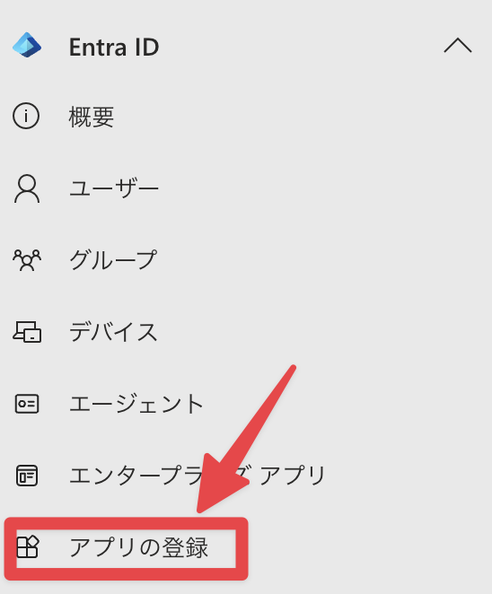
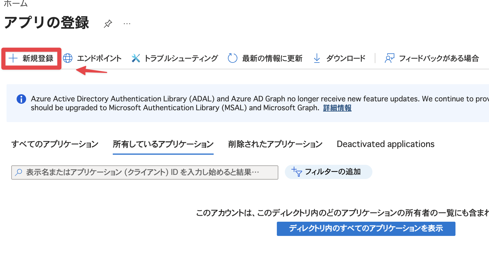
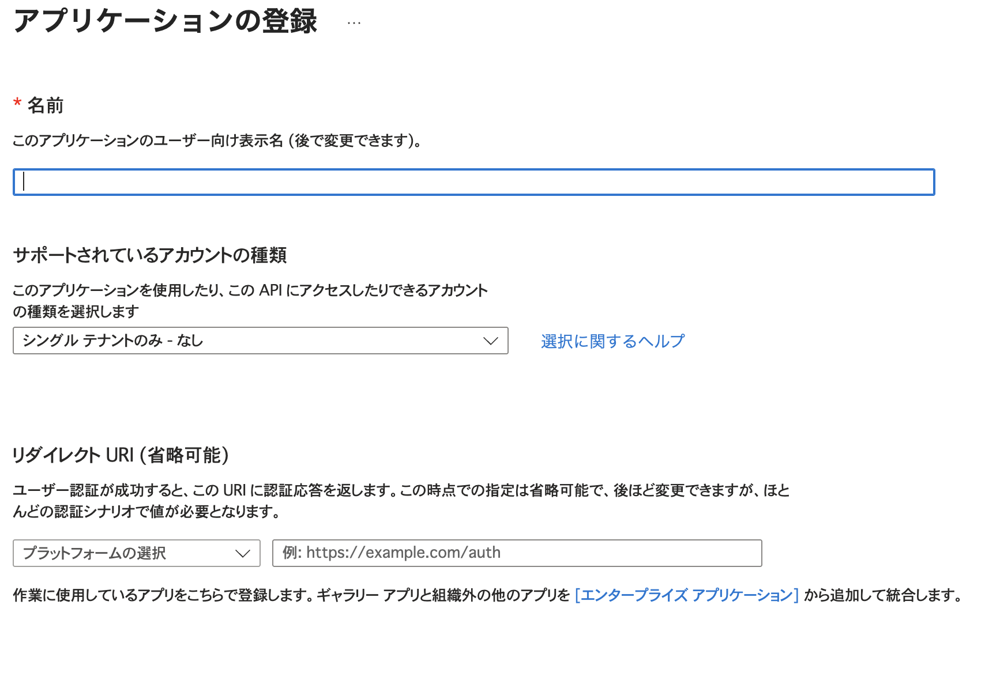
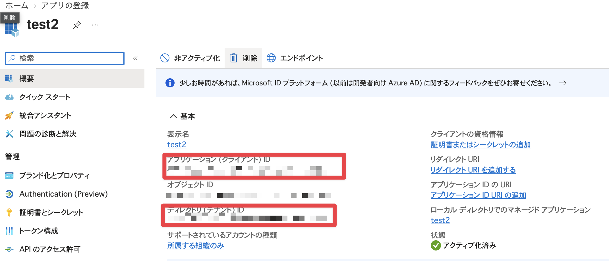
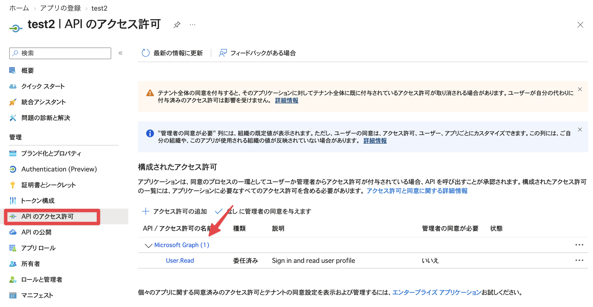
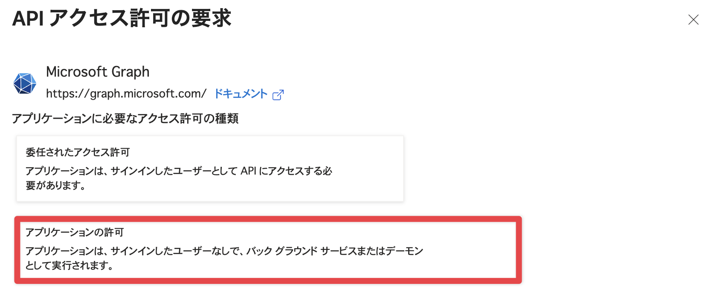
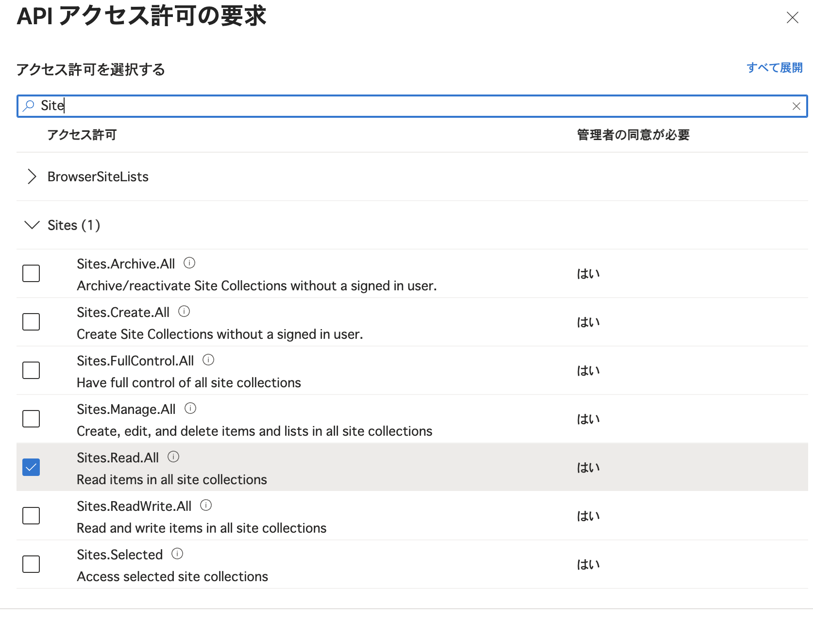
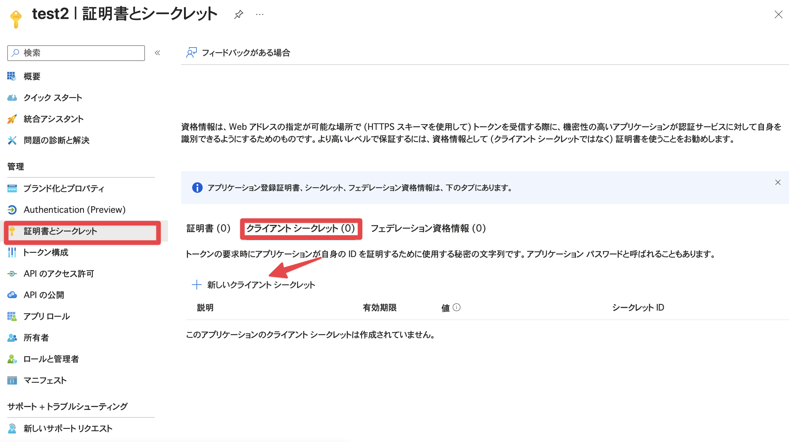

# Microsoft Graph API セットアップ手順

SharePoint のデータを Microsoft Graph API 経由で読み取るための、Entra ID アプリ登録手順のメモ。
認証は **クライアントクレデンシャルフロー**（ユーザーのサインインなしでバックグラウンド動作）を前提としている。

## 1. Entra ID へのアプリ登録

`entra.microsoft.com` →「アプリの登録」→「新規登録」

### 設定内容

| 項目 | 値 |
|---|---|
| 名前 | 任意（例: `test`。後から変更可） |
| サポートされているアカウントの種類 | シングルテナントのみ |
| リダイレクト URI | 空でOK（クライアントクレデンシャルフローのため不要） |

### 登録後にメモしておく値

- アプリケーション (クライアント) ID
- ディレクトリ (テナント) ID

## 2. API アクセス許可の設定

### 使う API は「SharePoint」ではなく「Microsoft Graph」

### 権限の種類の選び方

- **委任されたアクセス許可**: ユーザーがサインインした状態が前提（今回は不使用）
- **アプリケーションの許可**: ユーザーなしでバックグラウンド動作。クライアントクレデンシャルフローを使う場合はこちら

> [!WARNING]
> **ハマりポイント**: 委任されたアクセス許可とアプリケーションの許可は、後から種類を変更できない。
> 誤って追加した場合は一度削除してから、正しい種類で追加し直す必要がある。

### 設定した権限

| API | 権限 | 種類 |
|---|---|---|
| Microsoft Graph | `Sites.Read.All` | アプリケーション |

「+ アクセス許可の追加」→「Microsoft Graph」→「アプリケーションの許可」→ `Sites` で検索 → `Sites.Read.All` を選択

> [!NOTE]
> **アクセス範囲を絞りたい場合**
> `Sites.Read.All`（全サイト読み取り可）の代わりに `Sites.Selected` を使うと、サイト単位でアクセスを絞れる。
> ただしアプリ登録側の権限追加だけでは不十分で、対象サイトに対して個別に `POST /sites/{site-id}/permissions` を叩いて権限を紐付ける追加作業が必要。
> （今回は未検証、将来試す場合のメモ）

## 3. クライアントシークレットの発行

1. アプリ登録 →「証明書とシークレット」→「新しいクライアントシークレット」
2. 有効期限を選択（キーローテーションが必要なので適宜設定）
3. **「値 (Value)」列の文字列をその場でコピーして保存する**

> [!CAUTION]
> シークレットの値は画面を離れると二度と表示されない。また「シークレット ID」と間違えないこと。
> 発行した値は環境変数などで管理し、リポジトリにコミットしないこと。
