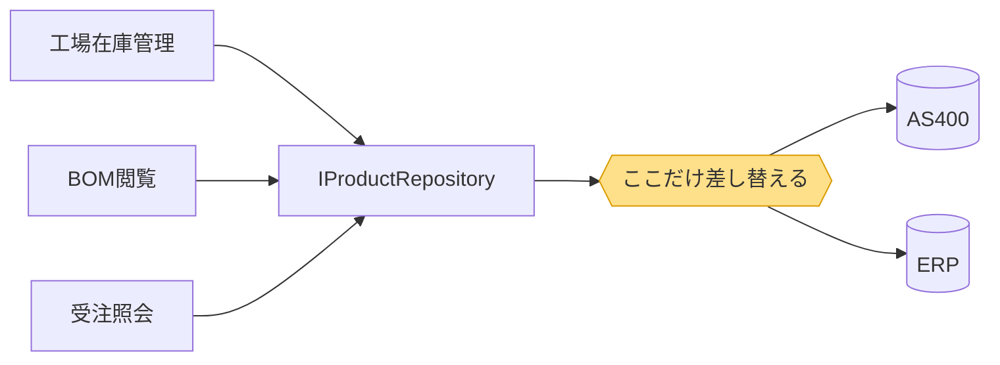
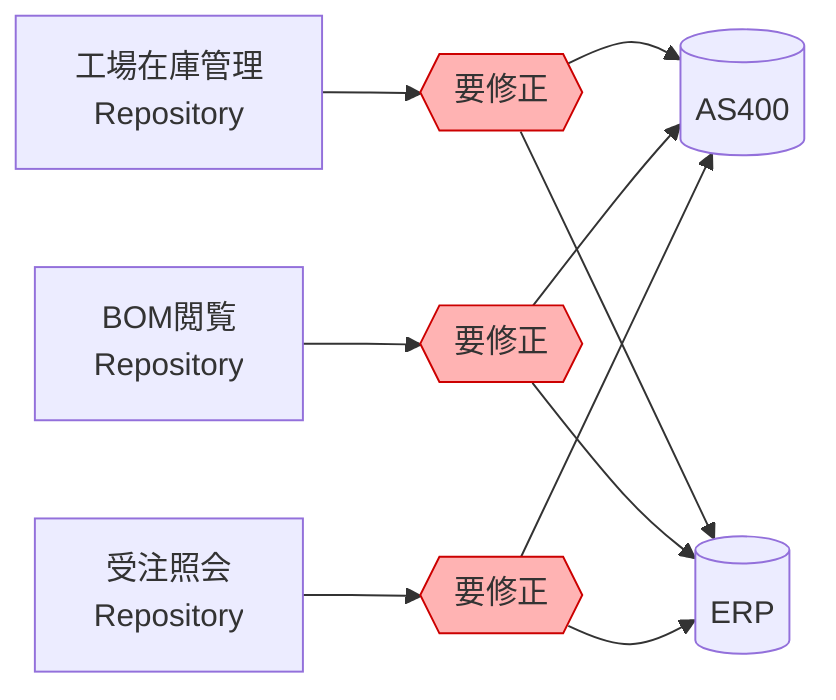

# バックエンドAPI入門：フィーチャーの分け方と構成パターン比較

## 1. Featureの粒度は2種類ある

- エンティティ単位（Products, Orders, Inventory）
  - `GET /api/products` … 商品マスタを返す
  - `GET /api/orders` … 受注データを返す（商品IDのみ保持）
  - `GET /api/inventory` … 在庫データを返す
  - → 画面に必要なデータは、フロント側で複数のエンドポイントを叩いて突き合わせる
- 機能単位（工場在庫管理, BOM閲覧など）
  - `GET /api/factory-inventory/list` … 工場在庫管理画面に必要なデータを返す
  - `GET /api/bom/{productId}` … BOM閲覧画面に必要なデータ（構成＋商品名）を返す
  - → 1画面につき1エンドポイントで、画面に必要な形のデータをまとめて返す

---

## 2. パターン1：Vertical Slice × ユースケース単位

「フィーチャーを *工場在庫管理* や *BOM閲覧* のような画面・ユースケース単位にすれば、フィーチャー間の依存が消えるのでは」という案です。

たしかに、この粒度にすると Products⇔Orders の依存はフィーチャー内部に吸収され、**表面上は依存が消えます**。
また不要になった機能は即時削除が可能なる。

```
（エンティティ単位）
Products/ ←→ Orders/        ← フィーチャー間依存として見える

（ユースケース単位）
工場在庫管理/
├── 商品参照
├── 受注参照
└── 在庫参照                ← 全部同じフィーチャー内 → 依存に見えない
```

### しかし問題は形を変えて出てくる

「BOM閲覧」機能は構成部品を表示するため、当然ながら商品（品目）マスタを参照する必要があります。このとき取れる選択肢は3つで、いずれも別の問題を抱えます。

### パターン1-A：外から呼ぶ（フィーチャー間依存）

```
Features/
├── 工場在庫管理/
│   ├── Controllers/InventoryController.cs
│   ├── Services/
│   │   ├── IProductService.cs           ← 公開せざるを得なくなる
│   │   └── ProductService.cs            ← 商品取得ロジックの本体
│   └── Repositories/
│       ├── IProductRepository.cs
│       └── ProductRepository.cs         ← 商品マスタへのアクセス
└── BOM閲覧/
    ├── Controllers/BomController.cs
    ├── Services/
    │   ├── IBomService.cs
    │   └── BomService.cs
    │           └─→ IProductService を参照  ← フィーチャー間依存
    └── Repositories/
        ├── IBomRepository.cs
        └── BomRepository.cs             ← BOM構成テーブルのみ担当
```

**メリット**：ロジックは1箇所に保たれる。整合性は崩れない。

**デメリット**：独立した箱にしたはずが結局フィーチャーをまたぐ参照が発生し、データの持ち主が名前から読み取れない。工場在庫管理を消すと依存しているBOM閲覧の機能が使えなくなる。

### パターン1-B：それぞれで持つ（ロジックが重複）

```
Features/
├── 工場在庫管理/
│   ├── Controllers/InventoryController.cs
│   ├── Services/
│   │   ├── IProductService.cs
│   │   └── ProductService.cs            ← 商品取得ロジック
│   └── Repositories/
│       ├── IProductRepository.cs
│       └── ProductRepository.cs         ← 商品マスタへのアクセス
└── BOM閲覧/
    ├── Controllers/BomController.cs
    ├── Services/
    │   ├── IBomService.cs
    │   ├── BomService.cs
    │   ├── IBomProductService.cs
    │   └── BomProductService.cs         ← ほぼ同じ商品取得ロジック（重複）
    └── Repositories/
        ├── IBomRepository.cs
        ├── BomRepository.cs
        ├── IBomProductRepository.cs
        └── BomProductRepository.cs      ← 同じ商品マスタを別経路で参照（重複）
```

**メリット**：フィーチャー間の参照が本当になくなる。各フィーチャーは完全に独立して開発・削除できる。

**デメリット**：同じ商品マスタテーブルに対するアクセスコードが2箇所に存在する。
商品マスタの仕様変更（項目追加、廃番品の除外ルールなど）のたびにService・Repositoryの両層を2セット直す必要があり、**片方だけ直して不整合**というバグの温床になる。
フィーチャーが増えるほど直す箇所も増える。

### パターン1-C：1つの機能に閉じたServiceとRepositoryに集約する

クラスを二重に持つのではなく、BomRepositoryの中でBOM構成テーブルと商品マスタをJOINし、画面に必要な形のデータを一度に取得。今のASPに近いパターン。昨日は伊藤さんと話してこのパターンが良いのではないかと思いました。

```
Features/
└── BOM閲覧/
    ├── Controllers/BomController.cs
    ├── Services/
    │   ├── IBomService.cs
    │   └── BomService.cs
    └── Repositories/
        ├── IBomRepository.cs
        └── BomRepository.cs   ← BOM構成 + 商品マスタをJOINして
                                  構成も商品名もまとめて取得
```

**メリット**：最もシンプルで、クエリも1本で完結するため性能的にも有利。機能に閉じるのでFeature内に閉じていて削除しても影響範囲がない。

**デメリット**：基幹システムがAS400→ERPの移行中であり、インターフェースで吸収してリポジトリを切り替えるという方法が難しくなる。具体的には以下の3点。

1. **移行途中はJOINが物理的に書けなくなる**

移行は一度に全テーブルが切り替わるわけではなく、テーブル単位で段階的に進みます。その過程で、参照したいテーブル同士が別のデータソースに分かれる期間が発生します。

```
移行途中の状態
BOM構成テーブル → AS400にまだ残っている
商品マスタ       → ERP側に移行済み
```

DBを跨いだJOINはできないため、「クエリ1本で完結」というこのパターン最大のメリットが成立しなくなります。しかも書き直しはBOM閲覧だけでなく、同じように商品マスタへJOINしている全機能で同時に発生します。

2. **切り替えポイントが機能の数だけ分散する**

Interfaceで吸収する構成であれば、データソースの切り替えは商品マスタのRepository 1箇所を差し替えるだけで済みます。一方このパターンでは、各機能のRepositoryがそれぞれ商品マスタへJOINしているため、**移行のたびに商品マスタを参照している全機能のSQLを洗い出して修正する**必要があります。移行対象が増えるほど、この探索と修正のコストが機能数に比例して増えていきます。

**Interfaceで吸収する場合：切り替えポイントは1箇所**



**各機能で直接JOINする場合：切り替えポイントが機能の数だけ増える**



機能が3つならまだしも、実際には商品マスタを参照する画面はこの先も増え続けます。増えた分だけ移行時の修正対象も増えるため、移行が長期化するほど負担が効いてきます。

3. **新旧の突き合わせ検証が効かない**

移行では、旧（AS400）と新（ERP）の両方から取得して結果が一致するかを検証する仕組みを入れます。Repositoryを差し替えられる構成ならこの検証を1箇所に仕込めますが、各機能が直接JOINしているとその経路を通りません。結果として、**その機能から読んだデータだけが検証の対象外になり**、移行の正しさを担保しきれなくなります。

### パターン1全体の結論

ユースケース単位で切っても「データの持ち主は誰か」問題は解決せず、**依存の復活（1-A）／ロジックの重複（1-B）／SQLへの重複移動と移行検証の穴（1-C）** のいずれかに必ず着地します。フィーチャーが独立して見えるのは、エンティティ単位の依存を画面の中に隠しているだけです。

---

## 3. 結果的に以下の二点のどちらかがいいかと・・・

## 4. パターン2：Vertical Slice × エンティティ単位

各フィーチャーが、自分専用のController・Service・Repository・Modelを一式持ちます。

```
Features/
├── Products/
│   ├── Controllers/ProductsController.cs
│   ├── Services/IProductService.cs, ProductService.cs
│   ├── Repositories/IProductRepository.cs, ProductRepository.cs
│   └── Models/Product.cs
└── Orders/
    ├── Controllers/OrdersController.cs
    ├── Services/IOrderService.cs, OrderService.cs
    ├── Repositories/IOrderRepository.cs, OrderRepository.cs
    └── Models/Order.cs
```

### 依存のルール

**OK**

```
OrdersService → IProductService（Products側が公開したInterface経由）
```

**NG**

```
OrdersRepository  → ProductsのDBテーブルに直接クエリ
OrdersController  → ProductRepository を直接呼ぶ
OrdersService     → ProductService の実装クラスを直接new
```

### メリット

- 1つのフィーチャーに関わるコードが1フォルダに収まり、**全体像を把握しやすい**
- 新機能の追加が、既存フォルダを触らずフォルダ1つ追加で済む
- 理論上、フォルダごと削除すればその機能を丸ごと外せる
- データの持ち主（誰が商品マスタを管理するのか）が明確

### デメリット

- **依存の向きが構造に現れない**。ルート階層を見ても分かるのは「ProductsとOrdersがある」ことだけで、「Controller → Service → Repository の順に呼ぶ、逆流はNG」というルールはフォルダを開くまで見えない
- 同じ縦の構造がフィーチャーの数だけ複製されるため、**「このフィーチャーだけControllerがRepositoryを直接呼んでいる」といった逸脱がレビューで見つけにくい**
- 「共通処理はどこか」「このRepositoryのパターンは他でも使っているか」を調べるとき、全フィーチャーフォルダを開いて回る必要がある
- 層をまたぐ横断作業（前述のAS400→ERP移行など）と相性が悪い
- **複数のマスタをまたぐ複合サービスが作りにくい**（下記）

### 複合サービスの置き場所が決まらない問題

BOM閲覧のように、**品目マスタ（Products）と構成マスタ（Bom）の2つのRepositoryを使って1つの結果を組み立てる**処理は必ず出てきます。この構成では、そのサービスをどこに置くかが決まりません。

```
Features/
├── Products/
│   ├── Services/ProductService.cs
│   └── Repositories/ProductRepository.cs      ← 品目マスタ
└── Bom/
    ├── Services/BomService.cs
    │       ここに置く？ → Products側のRepositoryを使うことになる
    └── Repositories/BomRepository.cs          ← 構成マスタ
```

- `Bom/` に置くと、Bom側のServiceがProductsのデータを取りに行く形になり、「フィーチャーは独立した箱」という前提が崩れる
- `Products/` に置くのも不自然（BOMの都合で品目マスタ側にコードが増えていく）
- ルール上、他フィーチャーのRepositoryを直接呼ぶのはNGなので、`IProductService` を経由することになる。すると **Repository → Service → 別フィーチャーのService → Repository** と経路が1段深くなり、単に2つのマスタを引きたいだけの処理が回りくどくなる
- かといって複合処理専用のフィーチャーを新設すると、それは実質パターン1（ユースケース単位）に戻ってしまう

パターン3（レイヤード）では、Repositoryが `Repositories/` に揃っているため、複合サービスは `Services/Bom/BomQueryService.cs` に置いて `IProductRepository` と `IBomRepository` の2つを注入すれば済みます。置き場所に迷う余地がなく、経路も1段浅くなります。

---

## 5. パターン3：レイヤード × エンティティ単位

層で分け、その中をフィーチャーのサブフォルダで分けます。フィーチャーは「独立した箱」ではなく、**各層の中の区画**として扱います。

```
InventoryApi/
├── Controllers/
│   ├── Products/ProductsController.cs
│   └── Orders/OrdersController.cs
├── Services/
│   ├── Products/IProductService.cs, ProductService.cs
│   └── Orders/IOrderService.cs, OrderService.cs
├── Repositories/
│   ├── Products/IProductRepository.cs, ProductRepository.cs
│   └── Orders/IOrderRepository.cs, OrderRepository.cs
└── Models/
    ├── Products/Product.cs
    └── Orders/Order.cs
```

### メリット

- **依存の向きがトップレベルの構造に現れる**。`Controllers/ → Services/ → Repositories/` と並んでいるため、「上から下へ呼ぶ、逆流はNG」というルールをフォルダを指しながら1回で説明できる。規約違反もレビューで気づきやすい
- **層をまたぐ横断作業がしやすい**。AS400移行はRepository層を横断して進む作業であり、「全Repositoryの実装状況を確認する」「Shadow対応の漏れを探す」が `Repositories/` を開くだけで済む
- 「共通処理はどこか」「このRepositoryのパターンは他でも使っているか」を調べるとき、同じ種類のコードが1箇所にまとまっているため見つけやすい
- **複数マスタをまたぐ複合サービスが作りやすい**（下記）
- 既存のInventoryApiリポジトリのスタイルと揃う

### 複合サービスの実装

パターン2で問題になった「品目マスタと構成マスタの2つを使うサービスをどこに置くか」が、この構成では迷いません。Repositoryはすべて `Repositories/` に揃っているため、必要な数だけ注入すれば済みます。

```
InventoryApi/
├── Services/
│   └── Bom/
│       ├── IBomQueryService.cs
│       └── BomQueryService.cs      ← 2つのRepositoryを注入
└── Repositories/
    ├── Products/IProductRepository.cs   ← 品目マスタ
    └── Bom/IBomRepository.cs            ← 構成マスタ
```

```csharp
public class BomQueryService : IBomQueryService
{
    private readonly IBomRepository _bomRepository;
    private readonly IProductRepository _productRepository;

    public BomQueryService(
        IBomRepository bomRepository,
        IProductRepository productRepository)
    {
        _bomRepository = bomRepository;
        _productRepository = productRepository;
    }

    public async Task<BomView> GetAsync(string productId)
    {
        var components = await _bomRepository.GetComponentsAsync(productId);
        var products = await _productRepository.GetByIdsAsync(
            components.Select(c => c.ComponentProductId));

        // 構成と品目名を組み立てる
        return BomView.Create(components, products);
    }
}
```

ポイントは次の3点です。

- **置き場所が一意に決まる**。BOMを主体とする処理なので `Services/Bom/` に置く、という以上の議論が発生しない
- **経路が浅い**。パターン2のように `Service → 別フィーチャーのService → Repository` と経由せず、必要なRepositoryを直接注入できる
- **移行時の切り替えが効く**。データ取得は `IProductRepository` を通っているため、AS400→ERPの切り替えも新旧の突き合わせ検証も、Repositoryの差し替え1箇所で吸収できる

### デメリット

- 1つのフィーチャーに関わるコードが4つのフォルダに分散するため、**「商品まわりを全部見たい」ときに複数フォルダを開く必要がある**
- 1フィーチャーを丸ごと切り出す／削除するのが難しい
- フィーチャーが非常に多くなると、各層のフォルダ内が肥大化する
