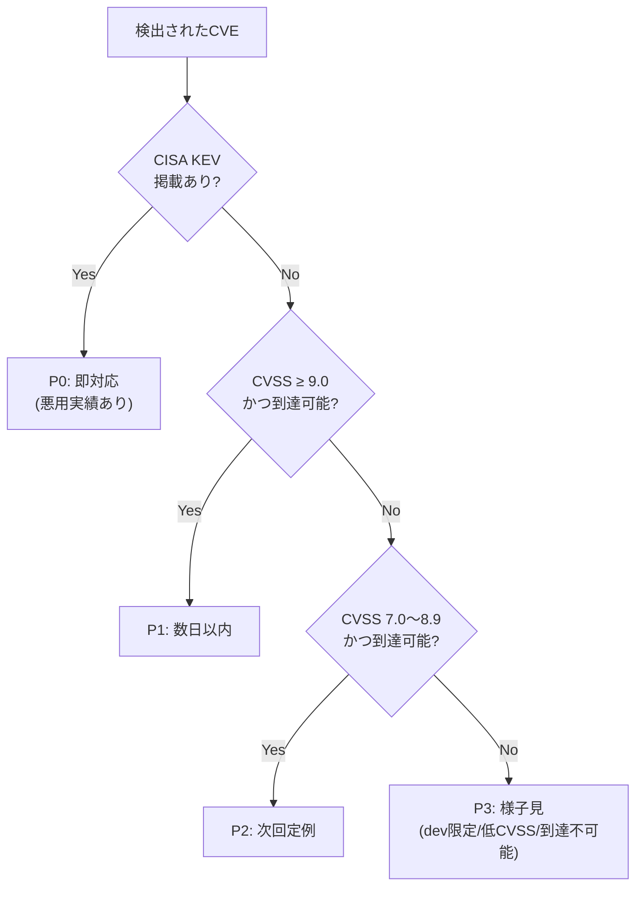
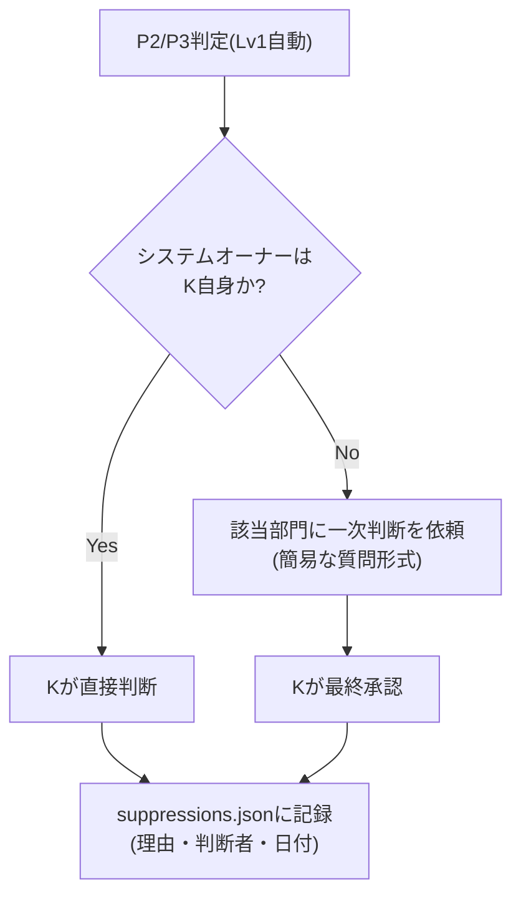

# OsvScan CVEトリアージ・ディレクトリ構成・未決事項

## 6. CVEトリアージ基準

CVSSスコア(理論上の深刻度)だけでなく、**実際に悪用されているか(CISA KEV)** を最優先の判断軸に据えた。



**情報源の優先順位**

| 優先度 | 情報源 | 役割 |
|---|---|---|
| 1 | CISA KEV | 悪用実績の有無(最重要フラグ) |
| 2 | OSVの`severity`(CVSS) | なければCVE経由でNVD APIから補完 |
| 3 | 依存関係の種別(dev/prod) | devDependencies等の除外判定 |

**CISA KEVの特性**
- 「実際に悪用が確認された」もののみ掲載される高信頼ソース。ただし掲載までのリードタイムは悪用開始より遅れる傾向があり、「載っていない=安全」ではない
- 更新頻度は不定期(週に複数回、活発期は毎日)。`osv_scan.py`側でキャッシュしつつ半日〜1日程度の有効期限で再取得する運用が妥当

**CI等でFail/Passの二値判定にする場合**
- P0とP1のみをFail対象にするのが実運用として妥当。P2以下まで含めるとノイズが増え、アラート疲れで形骸化しやすい

**サプレッション(対応不要判断の記録)**
- 一度「対応不要」と判断したCVEは、判断理由・判断者・日付とセットで抑制リストに記録し、次回以降は自動的にP3/非表示扱いにする

**P2以降の運用**

P0/P1が「即動く」基準なのに対し、P2以降は**溜めて定期処理する**設計にする。

| 優先度 | 対応方針 |
|---|---|
| P2 | 都度対応ではなく、Renovateの依存更新PRレビューのタイミングでまとめて処理(月1回目安) |
| P3 | 基本は放置してよいが、レポートからは消さない。固定判定にせず**毎回のスキャンで再評価**する |

**P3などの再評価(昇格)トリガー**

固定の優先度を保存するのではなく、毎回スキャン時に判定し直す設計にすることで、KEV追加のような外部要因の変化を自動的に拾える。

| 変化 | 遷移 |
|---|---|
| KEVに新規掲載された | P3/P2 → P0 に即昇格 |
| devDependencies→prodへ依存が変わった(到達可能になった) | P3 → P1/P2 に再判定 |
| PoC(実証コード)が公開された | P3 → P2 目安で引き上げ検討 |
| 一定期間(例: 90日)経過してもP3のまま | 棚卸しリストに載せて人間が一度目視 |

**P0/P1の出現頻度の目安**

- **P0(KEV掲載)**: KEVは全CVE30万件超のうち約1,484件(0.48%)に絞られた狭き門で、かつMicrosoft・Fortinet・Ivanti・Oracleなどネットワーク機器/エンタープライズ製品に偏りがち。ASP.NET Core/npm系の自社開発システムの依存パッケージが直撃するのは体感で**年に数回あるかないか**が現実的なライン。頻度は低いが当たった時のインパクトは大きい
- **P1(CVSS≥9、到達可能)**: KEVよりずっと頻繁で、依存パッケージ数次第だが**月に数件〜十数件**は出ることが多い。npmは転移的依存(孫依存)が多く、高スコアCVEは定期的に湧く
- 四半期スキャンだと悪用までの平均日数(目安5日程度)に対して45〜90日の空白期間ができるため、日次実行の設計は理にかなっている
- 運用開始後は実際の検出件数を記録し、P1の「数日以内」SLAが無理なく回るか(閾値をCVSS9.5に上げる等の調整が必要か)を見極めるとよい

**P2以降の到達可能性判定**

到達可能性の判定は、コストの低い順に段階分けする。フル機能の呼び出しグラフ解析は自前実装だと重すぎるため、そこまではやらない。

| レベル | 判定方法 | 自動化コスト | 判定者 |
|---|---|---|---|
| Lv1 | `package.json`/`requirements.txt`でdirect/transitive, prod/dev区分 | 低(マニフェスト解析のみ) | 自動(`osv_scan.py`) |
| Lv2 | ソース全体を`grep`してimport/require有無を確認 | 低〜中 | 自動(ただし誤検知あり: 動的import等) |
| Lv3 | 実際に使っているか・影響あるかの一次判断 | 高(基本手動) | **各部門(システムオーナー)** |
| 最終承認 | 部門判断を受けてsuppressions.jsonに記載するか承認 | - | K |

- Lv1・Lv2は`osv_scan.py`に組み込める自動処理
- Lv3はgrepベースの自動判定だと誤検知が多く機械的に裁くのは弱いため、**システムのオーナー(部門)に一次判断を投げる**運用にする
- InventoryWebのようにK自身がオーナーのシステムは即判断できるが、mcframe ERPやAS400連携部分など他部門が絡むシステムは、判断を仰ぐ相手を先に決めておく必要がある
- 部門判断は「到達可能か」ではなく「このパッケージ知ってる？使ってる?」程度の簡易な質問に落とし込む。部門判断だけだと甘めに判定されがちなため、K最終承認は必ず挟む



**人間が実際にCVE内容を読む範囲**

「機械的にバケット分けするフェーズ」と「実際に読むフェーズ」を分けることで、人間の負荷を最小限にできる。

| 段階 | 人間が読むか |
|---|---|
| P0/P1/P2/P3への機械的な振り分け | 読まない(Lv1自動 + CWEカテゴリ分類で完結) |
| suppressionリストへの記載(P2以降を「対応不要」にする) | OSVの`summary`(1〜2行要約)レベルで軽く読む |
| P0/P1の実際の対応方針決定 | しっかり読む |

- OSVレスポンスに含まれる`CWE-ID`(脆弱性の種類、例: CWE-79=XSS, CWE-798=ハードコードされた認証情報)を使い、危険度の低いカテゴリ(DoS系等)は自動でP3寄りに倒せる
- 逆にRCE系(CWE-94, CWE-502等)は自動で「危険」寄りに倒し、それ以外の曖昧なものだけ人間判断に回すフィルタをかけると、読む対象自体をかなり絞れる
- 全件読むのを避けたいなら、**CWEカテゴリでの自動的な危険度ラベリング**をLv1に追加するのが最も効果的(`osv_scan.py`のレポート出力に含められ、実装コストも低め)

---

## 7. フェーズ2(今回は対象外)

- SBOM(CycloneDX)との突合機能
- レポート未提出PCの自動検知(ファイルサーバー側の集計バッチ。「結果が上がってこない=異常」という運用フローで検知する想定)
- OSVレスポンスの`aliases`からCVE IDを抽出してレポートに含める処理
- CISA KEVとの自動突合によるP0自動判定
- **`config\suppressions.json`(CVE除外・サプレッションリスト)**: 対応不要と判断したCVEを、判断理由・判断者・日付とセットで記録し、次回以降のスキャンで自動的に抑制する仕組み。`osv_scan.py`側の読み込み実装が必要なため次フェーズ扱い

---

## 8. ファイルサーバー ディレクトリ構成・権限

```
\\fileserver\share\OsvScan\
  dist\
    osv_scan.py                   ← 配布元(手動更新)
  reports\
    <hostname>_<YYYYMMDD>.json    ← 各PCからのスキャン結果アップロード先
```

| フォルダ | 全社員(各PC) | K(管理者) | 備考 |
|---|---|---|---|
| `dist\` | 読み取りのみ | フル制御 | `run_osv_scan.bat`が毎日読みにいく先。書き込みはK限定で改ざん防止 |
| `reports\` | 作成のみ(一覧閲覧・読み取り不可) | フル制御 | 投稿箱(Drop Box)方式。他人のスキャン結果を誰も覗けない状態にする |

- `reports\`配下のファイル名にホスト名を含めることで、「誰の結果か」の特定と将来の未提出PC検知をしやすくする
- `config\`(除外リスト)は次フェーズで追加予定。追加時は「全社員:読取のみ / K:フル制御」で`dist\`と同じ権限モデルを踏襲する想定

---

## 10. 未決事項

- **npm対応の要否**: `osv_scan.py`は基本Python向けだが、InventoryWebのフロントエンド(React/TypeScript)はnpm依存。全社員PC配布 vs 開発者PCのみ配布で判断が変わる
  - 含める理由: 開発者PCには`node_modules`が存在し、npmは転移的依存が多く脆弱性の絶対数も出やすい
  - 除外する理由: 一般社員PCにはnpmパッケージが存在せず対象外でも影響なし。`node_modules`は1プロジェクトあたり数万ファイルになりがちで、対象に含めるとスキャン時間が伸びる(日次実行の負荷懸念に直結)
  - 論点: 配布対象を「全社員PC」と「開発者PCのみ」で分けるか、`node_modules`の存在有無で自動判定するかを検討する必要あり
