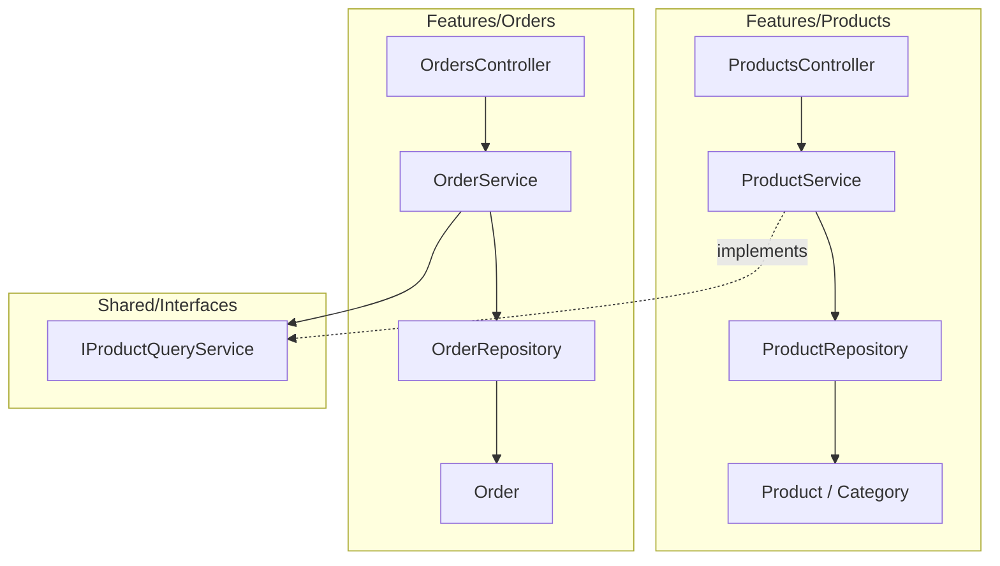
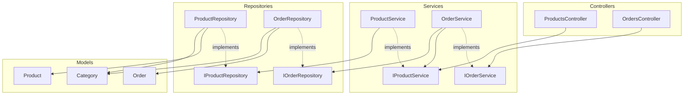

# Vertical Slice vs Layered Architecture ― 共通化(Shared)問題の比較

## 結論

Vertical Slice(Feature Folders)は「共通化すべきものが埋もれやすい」。Layered Architectureはこの問題がそもそも起きにくい。

## なぜ差が出るか

**Vertical Slice**
- featureフォルダは「独立した箱」であるべきという思想がある
- 他featureに公開するには、Interfaceを`Shared/`に**昇格**させる必要がある
- 昇格を忘れると、実装クラス(Repositoryなど)への直接依存が生まれるリスクがある。C#では`public`クラスは名前空間さえ通せば同一プロジェクト内のどこからでも参照でき、フォルダによる「featureの独立性」はコンパイラが強制してくれるものではないため、これは普通にビルドが通ってしまう
- さらに、正規のInterfaceが見つからないと「まだ共有されていない」と思い込み、既存の`IProductQueryService`に気づかないまま似たようなInterfaceを新規に作り直してしまうリスクもある
- featureが増えると`Shared/`が肥大化し、種類ごとに整理すると事実上「Vertical Sliceの中にMini Layered Architectureが生まれる」二重構造になる

```
Features/
├── Products/
│   ├── ProductsController.cs
│   ├── ProductService.cs : IProductQueryService   # Ordersに公開するAPIを実装
│   ├── ProductRepository.cs                        # 内部実装。Sharedに出さない
│   └── Interfaces/
│       └── IProductQueryService.cs                 # 規約通りここには元々ある
├── Orders/
│   ├── OrdersController.cs
│   ├── OrderService.cs
│   │   → IProductQueryServiceを使いたいが、どこにあるか一目でわからない
│   │   → 昇格し忘れると… ↓ こうなる
│   │
│   │   ❌ OrderService.cs
│   │      └── Features/Products/ProductRepository.cs を直接参照
│   │          (ProductServiceのビジネスロジックを素通りしてDBに直接アクセス)
│   │
│   └── OrderRepository.cs
└── Shared/
    └── Interfaces/
        └── IProductQueryService.cs   # 昇格させるならここ、のはずだが…
```

- 昇格が必要かどうかは「見つからなかった」時点では判断できない ―「まだ昇格されていないだけ」なのか「そもそも共有しない設計」なのか区別がつかない
- 結果、`OrderService`が正規のInterfaceではなく`ProductRepository`という実装クラスに直接依存してしまう

```
Shared/                          ← ここだけ見ると、事実上「層」構成そのもの
├── Interfaces/    ← Service層の公開窓口
│   ├── IProductQueryService.cs   # 前述の例で昇格させたもの
│   └── IOrderQueryService.cs     # Ordersも他featureに公開する必要が出てきたら同様に昇格
├── Repositories/   ← 技術的な共通基盤
│   └── IRepository.cs
├── Models/         ← 複数featureが参照するモデル
│   └── Category.cs
├── Middleware/
│   └── ErrorHandlingMiddleware.cs
└── Gateways/
    └── IExternalDbGateway.cs
```

- `Shared/`の中だけを見ると、Interfaces→Repositories→Modelsという**Layered Architectureそのものの層構成**になっている
- つまり「Vertical Sliceの各featureは独立した箱」という前提を保ちつつ、共通化したいものが増えるたびに`Shared/`の中でこのMini Layered Architectureを育てていくことになり、アプリ全体で見るとVertical SliceとLayered Architectureの二重構造を抱えることになる
- ここで「とりあえず`Products`フォルダを丸ごと`Shared/`に移す」という対応はNG。`Products`は独立したfeatureからただのインフラに格下げされ、所有権が曖昧になってしまう。あくまで昇格させるのは公開したいInterfaceだけで、実装フォルダごと移すことは避ける

**Layered Architecture**
- 層をまたぐ依存の向き(Controllers→Services→Repositories→Models)が最初から一方向に固定されている
- feature固有のInterfaceは元のフォルダに置いたまま、他featureから直接参照してよい → **昇格という概念自体が不要**
- Repositoryも共通の基底クラスは持たず、各featureごとに独立させる
- `Shared/`を作る場合も、置くのは**Excel出力やファイルアップロードのような、どのfeatureにも属さない完全に横断的な機能のみ**。`IProductService`のようなfeature固有のInterfaceはここには置かない

```
Services/
├── Products/
│   ├── IProductService.cs
│   └── ProductService.cs : IProductService
└── Orders/
    ├── IOrderService.cs
    └── OrderService.cs           # Products.IProductService を直接 using する
```

```
Repositories/
├── Products/
│   ├── IProductRepository.cs
│   └── ProductRepository.cs : IProductRepository
└── Orders/
    ├── IOrderRepository.cs
    └── OrderRepository.cs : IOrderRepository
```

```
Shared/
├── ExcelExport/           # Excel出力。どのfeatureにも属さない独立機能
│   ├── IExcelExportService.cs
│   └── ExcelExportService.cs
└── FileUpload/            # ファイルアップロード。同上
    ├── IFileUploadService.cs
    └── FileUploadService.cs
```

- どちらもProductsやOrdersなど特定featureの一部ではなく、それ自体が独立した横断機能なので最初から`Shared/`に置く
- 逆に`IProductService`のような「Productsというfeatureの窓口」はここには置かず、`Services/Products/`に残したまま他featureから直接参照する

## 全体構成(Layered Architecture採用時)

```
InventoryApi/
├── Controllers/
│   ├── Products/
│   └── Orders/
│
├── Services/
│   ├── Products/
│   │   ├── IProductService.cs
│   │   └── ProductService.cs
│   └── Orders/
│       ├── IOrderService.cs
│       └── OrderService.cs       # Products.IProductService を直接参照
│
├── Repositories/
│   ├── Products/
│   │   ├── IProductRepository.cs
│   │   └── ProductRepository.cs
│   └── Orders/
│       ├── IOrderRepository.cs
│       └── OrderRepository.cs
│
├── Models/
│   ├── Category.cs                ← 共通の複合クラス。Products.CategoryとOrders.Categoryをプロパティとして保持
│   ├── Products/
│   │   └── Category.cs            ← Products固有のプロパティを含む元のモデル
│   └── Orders/
│       └── Category.cs            ← Orders固有のプロパティを含む元のモデル
│
├── Data/                          ← 元々featureに属さない完全共通のもの
│   ├── AppDbContext.cs
│   └── Migrations/
│
├── Shared/                        ← 完全に横断的な独立機能のみ
│   ├── ExcelExport/
│   └── FileUpload/
│
├── Middleware/
└── Program.cs
```

## モデルについて

- 基本は各featureの`Models/`配下で個別に管理する(例: `Models/Products/Category.cs`)
- 共通化が必要になっても、元のモデルを`Models/`直下へ**移動**させるのではなく、各featureのモデルを**合成(コンポジション)**した**複合クラス**を`Models/`直下に新たに作る
- C#はクラスの多重継承ができないため、複数featureのモデルを1つのクラスにまとめるには継承ではなく合成を使う。複合クラスが各featureのCategoryをプロパティとして保持する形になる
- 元のfeature内モデルはそのまま残るので、featureごとの独立性を保ったまま、共有したい部分だけを複合クラス側にまとめられる

```
Models/
├── Category.cs               # 共通の複合クラス。Products.CategoryとOrders.Categoryをプロパティとして保持
├── Products/
│   └── Category.cs           # Products固有のプロパティを含む元のモデル
└── Orders/
    └── Category.cs           # Orders固有のプロパティを含む元のモデル
```

## 依存の仕方の比較(Mermaid)

### Feature Folders(Vertical Slice)の依存



- `OrderService`は`IProductQueryService`にしか依存しない
- `ProductService`がそのInterfaceを実装し、実処理の所有権は`Products`側に残る
- 昇格し忘れると`OrderService`が`ProductRepository`を直接参照する「迷子の依存」が起きる

### Layered Architectureの依存



- `Products`系と`Orders`系は各層の中で分かれているだけで、層をまたぐ依存の向きは常に一定
- Controller→Service、Service→Repositoryも実装クラスではなくInterface(`IPS`/`IOS`/`IPR`/`IOR`)に依存する。これはDIコンテナで実装を差し替えられるようにするための標準的な構成で、feature間公開のための「昇格」とは別の話
- `OrderService`は`Products`フォルダに置かれたままの`IProductService`を直接参照する。昇格や移動は発生しない
- `Category`のような共通データは、元のfeature内モデルを合成(コンポジション)した複合クラスとして`Models`層直下(`MShared`)に置く判断が必要

## まとめ表

| | Vertical Slice | Layered Architecture |
|---|---|---|
| feature間の直接依存リスク | 昇格し忘れで発生しうる | 発生しない |
| 共通化が要る範囲 | Interface・Modelどちらも`Shared/`判断が必要 | 判断が要るのはModelだけ(Repositoryも含め技術基盤の共通基底クラスは持たない。Modelは元を移動せず合成した複合クラスで対応) |
| `Shared/`フォルダ | 作る(feature固有Interfaceも含み肥大化しやすい) | Excel出力・ファイルアップロードなど完全に横断的な機能のみに限定して作る(feature固有Interfaceは置かない) |
